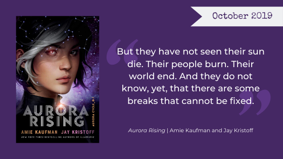

## Welcome to the Blog

Hello Reader! Welcome to the Nerd Girls Book Club Blog! We are so excited you're here. Join our monthly book club, dive deep on our favorite reads, and follow along with our bookish fun.

November is a month of fall colors and giving thanks here in the U.S., and we'll start off by remembering characters who have left a meaningful impact on us. Later in the month, Jane goes all in on a murder mystery, _Where the Crawdads Sing_.

Join the discussion on [Facebook](https://www.facebook.com/nerdgirlsbookclub) and follow us on Instagram [@nerdgirlsbookclub](https://www.instagram.com/nerdgirlsbookclub/).

## November's Book Club Pick

November's book club pick is [_Aurora Rising_](https://www.goodreads.com/book/show/30075662-aurora-rising) by Amie Kaufman and Jay Kristoff. On the third Wednesday of every month, we'll post our thoughts in a mini-review post. Pick up a copy of _Aurora Rising_ and read along with us.

From [Penguin Random House](https://www.penguinrandomhouse.com/books/548791/aurora-rising-by-amie-kaufman-and-jay-kristoff/9781524720964/):

<blockquote>

  From the _New York Times_ and internationally bestselling authors of the Illuminae Files comes a new science fiction epic . . .

  The year is 2380, and the graduating cadets of Aurora Academy are being assigned their first missions. Star pupil Tyler Jones is ready to recruit the squad of his dreams, but his own boneheaded heroism sees him stuck with the dregs nobody else in the academy would touch . . .

  A cocky diplomat with a black belt in sarcasm
  A sociopath scientist with a fondness for shooting her bunkmates
  A smart-ass tech whiz with the galaxy’s biggest chip on his shoulder
  An alien warrior with anger-management issues
  A tomboy pilot who’s _totally_ not into him, in case you were wondering

  And Ty’s squad isn’t even his biggest problem–that’d be Aurora Jie-Lin O’Malley, the girl he’s just rescued from interdimensional space. Trapped in cryo-sleep for two centuries, Auri is a girl out of time and out of her depth. But she could be the catalyst that starts a war millions of years in the making, and Tyler’s squad of losers, discipline cases, and misfits might just be the last hope for the entire galaxy.

  NOBODY PANIC.
</blockquote>

We look forward to taking this galactic journey with you! ❤

The Nerd Girls
