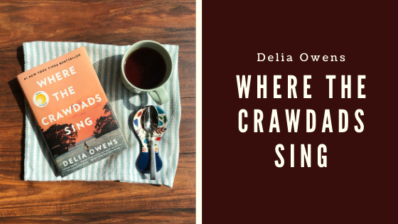
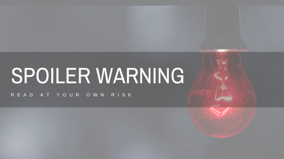

This month Jane shares a deep discussion on Delia Owens's 'Where the Crawdads Sing', a coming of age murder mystery. We will be going into spoiler territory.

**Content Warning: This book contains sexual assault and an attempted rape.**

## Summary

Title: *Where the Crawdads Sing*
Author: Delia Owens
Published: August 2018, G.P. Putnam's Sons
Genre: Coming-Of-Age Fiction, Mystery

When the star quarterback from a couple years back “falls” off the lookout tower in October of 1969, the small coastal North Carolina town of Barkley Cove is left to find out if this was a crime, but there’s little evidence and even fewer suspects. No one really had a problem with Chase Andrews. He wasn’t loved by everyone, sure, but who would want to kill him? The town immediately starts humming about one person who may have done it, after all based on rumors in town the Marsh Girl was responsible for all sorts of nefarious things.

Kya Clark has lived in the marsh her whole life. Her mom left when she was six, quickly followed by her four older siblings. She was left with her Pa before he left her too. Kya is forced to befriend the gulls and make sense of her life on her own. Much of her time is devoted to finding, buying or making food. She finally opens up to a few boys from town, learning how to love and also learning some hard lessons about life. She knows what the townspeople think of her, has seen the way they stare and how they talk to her. So she’s not surprised when they blame her for Chase’s death. Instead, the town is surprised by who they find Kya to be.

<h2 class="utl-color--jane">Jane's Thoughts</h2>

I should start my review first with a brief caveat. I was almost positive I would love this book before I started it. I love murder mysteries, and I love them even more when there’s the combination of a female protagonist to cheer for and a small town caught up in the drama of the murder. And so, I *did* love it, but that wasn’t really a surprise. The surprise was how beautiful the book was. Very rarely does the prose of the text live up to the plot of a good murder mystery. This book had equal parts beauty and anticipation; I felt the pull to slow down my reading to fully appreciate the beauty of the writing, but also read furiously to find out what actually happened to the quarterback on the tower.

The fascinating thing about *Crawdads* was how much of myself I found in Kya. It’s not every day that an author captures the awkwardness of puberty and a girl’s understanding of her own sexuality. And while not every girl has the same experiences of becoming a woman, I found Kya an incredibly relatable character in her embarrassment of her learning about and figuring out what to do about her period. Owens also did an incredible job of describing a young girl’s sexual discovery and desiring for men, some of whom she doesn’t even really like. Owens doesn’t shy away from writing about things that make little sense to Kya, especially when it comes to her understanding about herself. Reading Kya struggle through her coming of age story was like reliving my most awkward years all over again, but having the grace of experience to add to it. And so from Kya's perspective in the book, I found an easy friend, someone to cheer on.

I was literally six pages from the end of the book when I realized I didn’t actually care who committed the murder. I experienced love, loss, happiness, solitude, fear and strength through Kya’s eyes and that was enough for me. Then I finished the six pages, found out what happened and loved it even more.  

### Jane's Favorite Quotes

Pg 124
<blockquote class="utl-blockquote--jane">“And just at that second, the wind picked up, and thousands upon thousands of yellow sycamore leaves broke from their life support and streamed across the sky. Autumn leaves don’t fall; they fly. They take their time and wander on this, their only chance to soar. Reflecting sunlight, they swirled and sailed and fluttered on the wind drafts.”</blockquote>

Pg 242
<blockquote class="utl-blockquote--jane">“Let’s face it, a lot of times love doesn’t work out. Yet even when it fails, it connects you to others and, in the end, that is all you have *the connections*.”</blockquote>

Pg 354
<blockquote class="utl-blockquote--jane">“She knew his favorite lagoons and paths through difficult quagmires; always following him at a safe distance. Sneaking about, stealing love. Never sharing it. You can’t get hurt when you love someone from the other side of an estuary.”</blockquote>

---

*Have opinions on "Where the Crawdads Sing"? Join the discussion on [Facebook](https://www.facebook.com/nerdgirlsbookclub) or Instagram [@nerdgirlsbookclub](https://www.instagram.com/nerdgirlsbookclub/).*
