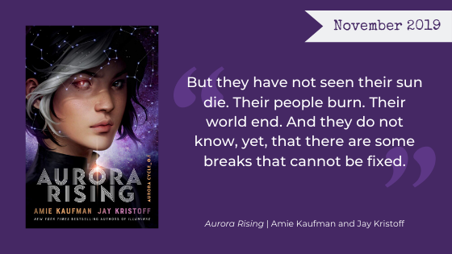

[Aurora Rising](https://www.goodreads.com/book/show/30075662-aurora-rising) is a YA SciFi Ensemble Space Adventure The Nerd Girls generally adored. Below, read our individual thoughts about the first book in Amie Kaufman and Jay Kristoff's *Aurora Cycle* series.

**Warning, Here Be Spoilers.**

<h2 class="utl-color--jane">Jane</h2>

### 👓👓👓👓 4 / 5

Uhhh...soo...fantasy isn’t really my thing. I like some fantasy stories well enough, but I wouldn’t go out of my way to pick one up. HOWEVER, I actually really enjoyed this book. The character development, especially early on drew me right in. I could picture the characters in my mind, but I kept reading to find out what exactly made them tick.  This book reminded me a bit of *The Martian* with the quick wit and near future science of exploration, except *Aurora Rising* is absolutely a YA novel through and through.

There were a couple gaping plot points that pulled me out of the story to question why on earth (or, you know, not Earth) the characters would act the way they did. (One of your crew members is literally dying! You’re supposed to be trying to save her! Why are you sauntering around chatting about your love life?!? Chat about that later!) But I really enjoyed reading it. I would read the next installment if only to spend some more time with the characters.

<h2 class="utl-color--elizabeth">Beth</h2>

### 👓👓👓👓 4.5 / 5

I lost sleep to finish this book—sleep, people! That should be enough of a review in and of itself. *Aurora Rising* was definitely a fun ride that for me falls into both the Stayed-Up-Late-To-Finish category and also the Kinda-Wish-I-Had-Written-It category. I love me an ensemble cast. I love the echoes of influences like *Star Trek* in the world, the story, and the characters. I like complicated family relationships and complicated friend relationships. I like twists that keep me guessing and foreshadowing that makes me feel smart at big reveals.
Not all characters were equally fleshed out, but I realize there are more books coming. I actually wanted even *more* conflict within the group (we did get a good amount, but this could have been pushed further). I will be waiting for book two and checking out these authors’ other works in the meantime.

<h2 class="utl-color--mary">Mary</h2>

### 👓👓👓👓 4 / 5

I’ll get right to the point with this one. I LOVED this book. I read it in the span of a few hours (with a very little bit of sleep in between) and had so much fun with the ragtag bunch of misfits that fill out the books cast. I’m not the biggest “space exploration” fan, but Kaufman and Kristoff create a fun world with just enough science and planetary exploration for a sci-fi lite fan like me.

The characters are compelling, though with varying levels of complexity, and I would’ve loved to see a bit more of their struggles to connect and work together, but some great twists, a stellar ensemble, and a little teen angst all make this a must read in my book! I’m so excited  for the sequel I’ve decided to tackle Kristoff’s *Nevernight* series in the meantime!

<h2 class="utl-color--catherine">Catherine</h2>

### 👓👓👓👓 4 / 5

> “Who am I to deny gravity, Aurora? When you shine brighter than any constellation in the sky?”

*Aurora Rising* is part *Hitchiker's Guide*, part *Sleeping Beauty*. Aurora is a half-Chinese, half-Irish young woman pulled out of time and into band of teenage space marines (though they are more like the [United Federation of Planets](https://en.wikipedia.org/wiki/United_Federation_of_Planets). Plus there are space elves. Who doesn't love space elves?

This action-packed sci-fi heist mystery has more character development than typical for an ensemble adventure. There are a few bumpy bits and some eye roll-worthy angsty teenage romance, but overall I loved it and I can't wait for the sequel.

The Audiobook is a well-acted delight. Plus, that cover by [Charlie Bowater](https://www.patreon.com/charliebowater) is incredible.
**Trope Warning**: Overly Flirty Pansexual Alien, aka [Anything That Moves](https://tvtropes.org/pmwiki/pmwiki.php/Main/AnythingThatMoves).

<h2 class="utl-color--lydia">Lydia</h2>

### 👓👓👓👓 4 / 5

I have to be honest, I did not expect to like *Aurora Rising* as much as I did. I came into it expecting the usual teen angst and romance in a sci-fi setting, and while I got that, I also got so much more. I ended up liking the book so much I went right back to the library and checked out pretty much every book that Kaufman and Kristoff have each ever written.

For a book with an ensemble cast, it sure packs a punch with character development. Kaufman and Kristoff give us glimpses of every character’s perspective, and even when those glimpses are short you get a good sense of who they are (and maybe fall in love with them a little bit). Combine that with a focus on friendship (over romance!) and the fun of a caper, and I was hooked.

I’m really looking forward to the next installment in this series.

---

*What were your thoughts about "Aurora Rising"? Join the discussion on [Facebook](https://www.facebook.com/nerdgirlsbookclub) or Instagram [@nerdgirlsbookclub](https://www.instagram.com/nerdgirlsbookclub/).*
