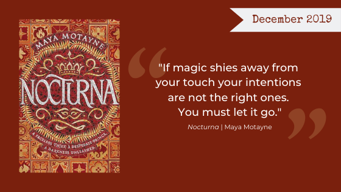

Have you been outrageously busy?! We’ve been outrageously busy. And for once, we're not just busy because we're reading a mountain of books! This month we are bundling up and compiling a list of our favorite cozy reads. We also have a longer, more in-depth review of *The Calculating Stars* by Mary Robinette Kowal, by bookclubber Mary. Then we of course have our book club mini reviews for the December Book of the Month!

## December’s Book Club Pick

Please read along with us on our December book club pick, *Nocturna* by Maya Motayne. Join our discussion on [Facebook](https://www.facebook.com/nerdgirlsbookclub) and follow us on Instagram [@nerdgirlsbookclub](https://www.instagram.com/nerdgirlsbookclub/)!

From [Harper Collins Publishers](https://www.harpercollins.com/9780062842732/nocturna/): 

<blockquote>
  The first in a sweeping and epic own voices debut fantasy trilogy—set in a stunning Latinx-inspired world—about a face-changing thief and a risk-taking prince who must team up to defeat a powerful evil they accidentally unleashed. Perfect for fans of Tomi Adeyemi, Leigh Bardugo, and V. E. Schwab.

  To Finn Voy, magic is two things: a knife to hold under the chin of anyone who crosses her…and a disguise she shrugs on as easily as others pull on cloaks.

  As a talented faceshifter, it’s been years since Finn has seen her own face, and that’s exactly how she likes it. But when Finn gets caught by a powerful mobster, she’s forced into an impossible mission: steal a legendary treasure from Castallan’s royal palace or be stripped of her magic forever.

  After the murder of his older brother, Prince Alfehr is first in line for the Castallan throne. But Alfie can’t help but feel that he will never live up to his brother’s legacy. Riddled with grief, Alfie is obsessed with finding a way to bring his brother back, even if it means dabbling in forbidden magic.

  But when Finn and Alfie’s fates collide, they accidentally unlock a terrible, ancient power—which, if not contained, will devour the world. And with Castallan’s fate in their hands, Alfie and Finn must race to vanquish what they have unleashed, even if it means facing the deepest darkness in their pasts.
</blockquote>

We’re looking forward to diving into this magic world with you! ❤

The Nerd Girls
