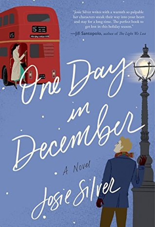

*Images in this article via [Goodreads](https://www.goodreads.com/)*

Okay, picture me: I’m sitting on a dark gray couch. I have my feet tucked underneath me with big wooly socks on, the kind with soft soles sewn on so they’re half house slipper, half socks. There’s a soft crackle of fire as the pine smell slowly wafts in and out of my consciousness. Outside I can almost hear the wind, but mostly it’s just making the window panes creak every once in a while. I’m balancing a glass of dark crimson wine in my right hand, gripping a book by the lower spine in my left. The book I’m reading is…

<h2 class="utl-color--jane">Jane</h2>

### [*One Day in December*](https://www.goodreads.com/book/show/38255337-one-day-in-december)</jane> by Josie Silver

I’ll be honest. I wrote the description above. Am I the only one drinking wine here?! It’s fine. No, no. It’s...it’s fine.

I’m reading Josie Silver’s *One Day in December* because my soul is ready for Hallmark Christmas movies but I also still want to read. Seriously, this book is just so damn FUN! And by fun, I mean I cried while reading it. Twice. Silver does a great job of creating complex characters who you go through periods of loving, disliking, not understanding and appreciating for their complexity. Laurie locks eyes with a man through the window of a bus and she’s almost positive she’s in love. But then her roommate brings her new boyfriend to meet her and she has to make a decision: does she say this is her bus-window-love-at-first-sight boy? This book is dying to be made into a rom-com. There’s love. There’s loss. There’s more love. Did I mention I cried? Ugh! I loved it so much.

<h2 class="utl-color--elizabeth">Beth<h2>

### [*The World of Winnie-the-Pooh*](https://www.goodreads.com/book/show/99111.The_World_of_Winnie_the_Pooh) by A.A. Milne

Reading is cozy, but what is even cozier? Why, being read to! With young kids, I’m usually the one doing the reading these days, but that doesn’t mean I’m done being a listener.

When my husband and I were first dating, I noticed a book on the shelf in his apartment—a very worn, very loved copy of *The World of Pooh*, an omnibus of the two original Winnie the Pooh books. I’d been a lifelong fan of the Disney-fied Pooh, but this was my first introduction to A. A. Milne’s original stories.

And they’re beautiful. They’re funny, they’re heartfelt, they’re sweet. The language is lyrical and stands up to countless readings. I have the fondest—*coziest*—memories of snuggling up with my husband in the early months of our relationship listening to all the adventures of Pooh, Piglet, and the rest of the crew from the Hundred Acre Wood. When I’m having a particularly hard time, I’m still known to pull that book off the shelf and ask for a story.

<h2 class="utl-color--mary">Mary<h2>

### [*A Court of Mist and Fury*](https://www.goodreads.com/book/show/17927395-a-court-of-mist-and-fury) by Sara J. Maas

All of my reading is cozy. It’s pretty much a prerequisite to opening a book. Even on hot summer days, I will have a cup of tea (usually ginger or black tea with vanilla) and a million pillows and a blanket somewhere nearby. But my ultimate cozy read? It has to be *A Court of Mist and Fury*, the second book in Sarah J Maas’s [*A Court of Thorns and Roses*](https://www.goodreads.com/series/104014-a-court-of-thorns-and-roses) series. After surviving the first round of Maas’s signature emotional torment, I find myself returning to the second book in this series, and its comforting slow-burn, over and over and over again. I know I’m not alone in feeling that this book is like a cup of chicken noodle soup. It’s warm and reliable and always fills a void, whether from a bad day, a book hangover, or just a need to revisit some favorite (though problematic) characters.

<h2 class="utl-color--catherine">Catherine</h2>

### [*Two Dark Reins*](https://www.goodreads.com/book/show/37486213-two-dark-reigns) by Kendare Blake

"Cozy Read" is, of course, curling up on the couch during a chilly rainy or snowy day, wearing my favorite college sweatshirt and comfy leggings, my cat, and a cup of tea (earl grey with milk, please). The best books are those I can escape fully into, losing hours at a time. Right now, that book is *Two Dark Reins*, the third installment in Kendare Blake's [*Three Dark Crowns*](https://www.goodreads.com/series/136654-three-dark-crowns) series. Fierce young women, with astounding magics, fighting to the death for a throne, what's not comforting about that? In all seriousness, this is a story about walking the line between duty and integrity, and its misty island setting is perfect for any rainy day.

<h2 class="utl-color--lydia">Lydia</h2>

### [*Faking It*](https://www.goodreads.com/book/show/33729.Faking_It) by Jennifer Cruise

To me, cozy means a blanket, kitties, and hot chocolate while watching rain or snow fall outside. It also means a book that’s a guaranteed happy ending, and for that I reach for romance. Jennifer Crusie’s *Faking It* always leaves me with a smile on my face. The characters are quirky and strange and likably dysfunctional. There are con artists and forgeries and precocious teenagers. The story feels like a Katharine Hepburn comedy in modern times, and I can read it in one sitting, again and again and again. While not necessarily “cozy” in the traditional sense, *Faking It* (and all of Jenny Crusie’s books) cheer me up when I’m down and brighten a gloomy day.

---

*What are your favorite cozy reads? Join the discussion on [Facebook](https://www.facebook.com/groups/566114107531110/) or Instagram [@nerdgirlsbookclub](https://www.instagram.com/nerdgirlsbookclub/).*
