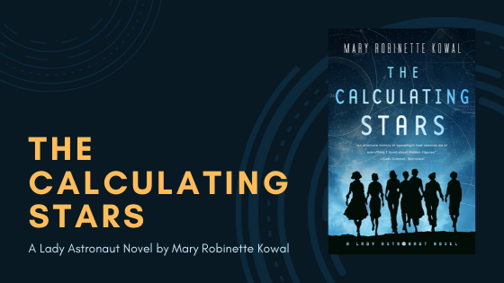
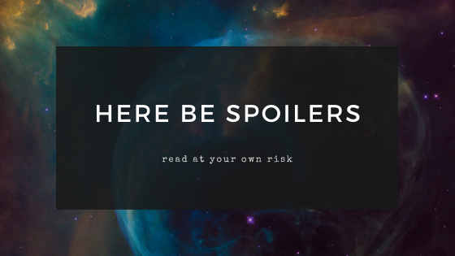

This month Mary heads into an alternative past with Mary Robinette Kowal's *[The Calculating Stars](https://www.goodreads.com/book/show/33080122-the-calculating-stars)*. There will be spoilers in this post!

## Summary

Title: *The Calculating Stars*
Author: Mary Robinette Kowal 
Published: July 2018,Tor Books
Genre: Historical Fiction, Science Fiction

<blockquote class="utl-blockquote--mary">
On a cold spring night in 1952, a huge meteorite fell to earth and obliterated much of the east coast of the United States, including Washington D.C. The ensuing climate cataclysm will soon render the earth inhospitable for humanity, as the last such meteorite did for the dinosaurs. This looming threat calls for a radically accelerated effort to colonize space, and requires a much larger share of humanity to take part in the process.

Elma York's experience as a WASP pilot and mathematician earns her a place in the International Aerospace Coalition's attempts to put man on the moon, as a calculator. But with so many skilled and experienced women pilots and scientists involved with the program, it doesn't take long before Elma begins to wonder why they can't go into space, too.

Elma's drive to become the first Lady Astronaut is so strong that even the most dearly held conventions of society may not stand a chance against her.
</blockquote>

via <a href="https://www.tor.com/2018/05/31/excerpts-the-calculating-stars-mary-robinette-kowal/">Tor</a>

<h2 class="utl-color--mary" style="margin-top:3rem">Mary's Thoughts</h2>

Part warning against climate change inaction, part model of growing ally-ship, and part epic “Lady Astronaut” adventure, Mary Robinette Kowal's *[The Calculating Stars](https://www.goodreads.com/book/show/33080122-the-calculating-stars)* made me feel A LOT of things while reading and I absolutely loved it!

Kowal's Hugo, Nebula, and Locus award winning novel is the first in the *Lady Astronaut* series, itself a prequel to her Hugo winning novelette [*The Lady Astronaut of Mars*](https://www.tor.com/2013/09/11/the-lady-astronaut-of-mars/). The novel asks us to reimagine the past, while engaging with very contemporary questions about climate change and complacency in the face of slow-moving disaster.

However, the imminent cataclysmic threat that incites the novel is grounded in Dr. Elma York's struggle for equality within the burgeoning space program. As a mathematician and former WASP Elma has the makings of an astronaut and can offer critical aid in the world's impending crisis, but she faces a constant barrage of structural inequalities that seek to keep her on the outside. Elma is smart and strong and flawed and working through her own biases as she faces and overcomes (and at times even smashes through) the hurdles stacked in front of her.

This is not necessarily an 'action packed' novel after the adrenaline-fueled opening. However, that's a plus for me in that it lets the relationships between characters take center stage as they fight to maintain a sense of normalcy while convincing others of the often invisible threat that awaits.  Her problems and her failures make her a 'real' character, and made *me* so much more invested in her successes. Kowal's intensely personal narrative style quickly captured my heart and tied it to Elma's struggles.

The at-times strained friendships between the women in the novel are its true emotional core and Kowal expertly navigates the dynamics of fighting for one's own achievements while simultaneously working to support others in the same quest.

The book, through these friendships, also serves as a reminder of the ways that women and especially women of color have been systematically erased from the history of the space program. While at times a bit didactic in its messages of inclusiveness, the novel's directness and refusal to shy away from difficult questions was refreshing and the story itself was moving (I cried in sorrow, joy, and frustration multiple times!).

Though I loved the book, I do have to say that I found myself cringing during some of the more…intimate scenes between Elma and her husband. Don't get me wrong, I love to see a healthy and consensual relationship between a loving couple, but there's only so many “rockets ready for lift off” I can take before my eyes begin to roll a bit.

Finally though, what made this book so particularly important to me where the representation of anxiety and Elma's reckoning with her own anxiety in the face of a cultural stigma. The work the novel does to normalize the treatment of anxiety seems particularly important today and resonated deeply.

I can't wait to start the next book in the series, which came out last year! The third book in the series has an expected publication date of summer 2020 with a fourth in the series confirmed as well!

---

*What did you Think of "The Calculating Stars"? Join the discussion on [Facebook](https://www.facebook.com/groups/566114107531110/) or Instagram [@nerdgirlsbookclub](https://www.instagram.com/nerdgirlsbookclub/).*
