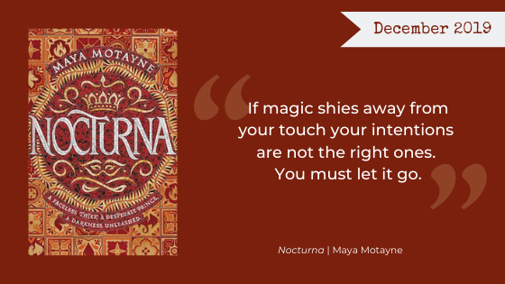

This month, we read [*Nocturna* (*A Forgery of Magic* #1)](https://www.goodreads.com/book/show/35561260-nocturna) by Maya Motayne, a Latinx, magic-driven heist story that, despite a promising premise, did not live up to the Nerd Girls’ hopes. Read our individual thoughts on the book below.

**Warning, Here Be Spoilers.**

<h2 class="utl-color--jane">Jane</h2>

### 👓👓 2.5 / 5

I wanted to enjoy *Nocturna*, but I struggled to finish it. One aspect that really bothered me was that all of the characters sounded the same in both their speech and their internal monologue. I had to flip back a couple times to see who was talking because it literally could have been any of the characters.

I think there was a strong basic outline for the plot, but the actual execution of it left me wanting more. There were some fairly large jumps in logic and actions the characters took just for the sake of the story/ ease of the plot moving forward that bothered me while I was reading. With that being said, I actually really loved the ending of the book and thought it finally did justice to who the author **said** the characters were (even though their actions rarely matched up with how they were described). I didn’t hate it; I don’t regret reading it; but I wouldn’t recommend it to anyone else.

<h2 class="utl-color--elizabeth">Beth</h2>

### 👓👓👓 3 / 5

It’s hard to put my finger on exactly what about *Nocturna* didn’t work for me. Things start off promising, but along the way that promise kind of falls apart. I like the complicated setting of a post-colonial world, I like the use of Spanish, I like Prince Alfie's backstory. He starts off with great motivation and I am here for it. I am also here for a protagonist who makes some great big mistakes and has to go about trying to fix them. Co-lead Finn has her sweet shapeshifting ability and, of course, her requisite dark backstory. But her ability goes underutilized and her backstory is definitely one I’ve seen before—people must love their badass teenage assassins. The broad strokes of *Nocturna*'s plot are good but somewhere in there we keep losing the more interesting threads.

A final note for all YA writers/editors/publishers: there are many kinds of love. I enjoy a good romance, but not every story calls for one. So often it can dilute characters’ motivations. Let’s all remember friendship is its own amazing and powerful bond.

<h2 class="utl-color--mary">Mary</h2>

### 👓👓👓 3 / 5

I was really excited about *Nocturna* and had been looking forward to its release for a while. The description of the novel as a Latinx-inspired, magic driven heist drew me in immediately! The beginning of the novel is promising, and the potential for the story world and magic system is definitely there, but ultimately the novel fell quite short of these early high expectations. In regard to plotting, solutions to problems seemed too neat and easy, and the magic is often overly convenient. Really though, it was the lack of consistent character development that I got stuck on. Character motivations were often murky, disjointed, or down right frustrating, and the unique and exciting world the novel is set in couldn’t make up for the lack of depth in a love story that really didn’t need to be there.

<h2 class="utl-color--catherine">Catherine</h2>

### 👓👓👓 3 / 5

*Nocturna* starts as a complex fantasy with an intricate magic system and somewhere around halfway does a belly-flow into lukewarm romance. I found myself bored and disappointed, which is so sad, because there is real potential in this lush world of language-powered magic. A writing teacher once said, “If you’re not telling the most interesting story in your world, you’re telling the wrong story.” There were at least three potentially more interesting tales nestled inside *Nocturna* than the one chosen to be told.

The card game near the beginning is one of the most creative things I’ve read this year. Unfortunately, that was the high point of the novel. I probably won’t  be picking up the sequel anytime soon.

Trope Warning: Daddy Problems Abound, aka [You Killed My Father](https://tvtropes.org/pmwiki/pmwiki.php/Main/YouKilledMyFather)

<h2 class="utl-color--lydia">Lydia</h2>

### 👓👓👓 3 / 5

I *really* wanted to love this book. The summary hooked me in, the characters seemed interesting, and it had *Spanish*! But in the end it just left me feeling…meh.  It kept me engaged enough to finish the book, but left me with no interest in reading any sequels. A lot of things seemed sort of convenient for the plot. Solutions to problems just fell into place without a lot of work from the characters, and the magical abilities of Alfie and Finn just *happened* to fit perfectly their needs for any situation they found themselves facing. There was a lot of potential in both the world and the story, but both needed more fleshing out and complexity to fulfill that potential.

---

*What were your thoughts about "Nocturna"? Join the discussion on [Facebook](https://www.facebook.com/nerdgirlsbookclub) or Instagram [@nerdgirlsbookclub](https://www.instagram.com/nerdgirlsbookclub/).*
