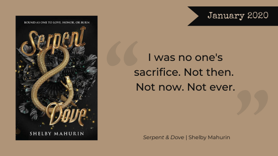

Happy New Year nerdy readers! This month, we are ringing in the new year with some of our most anticipated releases of 2020! What books are topping your TBR piles this year? We’d love to know! After that, Catherine will be diving deep into *[Ninth House](https://www.goodreads.com/book/show/43263680-ninth-house)* by Nerd Girl favorite Leigh Bardugo. And of course we will have our book club mini-reviews for the January Book of the Month: *[Serpent and Dove](https://www.goodreads.com/book/show/40024139-serpent-dove)*!

## January’s Book Club Pick

Please read along with us with our January book club pick, *Serpent and Dove* by Shelby Mahurin and join our discussion on [Facebook](https://www.facebook.com/nerdgirlsbookclub) and follow us on Instagram [@nerdgirlsbookclub](https://www.instagram.com/nerdgirlsbookclub/)!

From [Harper Collins Publishers](https://www.harpercollins.com/9780062878021/serpent-and-dove/):

<blockquote>
An Amazon Best Book of 2019!

"A brilliant debut, full of everything I love: a sparkling and fully realized heroine, an intricate and deadly system of magic, and a searing romance that kept me reading long into the night. Serpent & Dove is an absolute gem of a book." —Sarah J. Maas, #1 New York Times bestselling author of *A Court of Thorns and Roses* series

Bound as one, to love, honor, or burn. Book one of a stunning fantasy duology, this tale of witchcraft and forbidden love is perfect for fans of Kendare Blake and Sara Holland.

Two years ago, Louise le Blanc fled her coven and took shelter in the city of Cesarine, forsaking all magic and living off whatever she could steal. There, witches like Lou are hunted. They are feared. And they are burned.

As a huntsman of the Church, Reid Diggory has lived his life by one principle: Thou shalt not suffer a witch to live. But when Lou pulls a wicked stunt, the two are forced into an impossible situation—marriage.

Lou, unable to ignore her growing feelings, yet powerless to change what she is, must make a choice. And love makes fools of us all.

Set in a world of powerful women, dark magic, and off-the-charts romance, book one of this stunning fantasy duology will leave readers burning for more.
</blockquote>

We’re looking forward to exploring this world of witchcraft and romance with you!

The Nerd Girls
