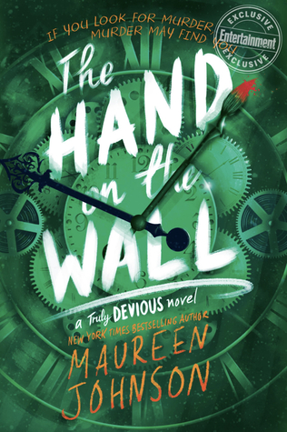

I’m not one for New Year’s resolutions, but every January I *do* find myself making lists of all the new releases I can’t wait to get my hands on, and this year is no different! We’ve (impossibly) limited ourselves to up to two 2020 releases that have us waiting anxiously for release day: one new book or series, and one continuation of a series we love. What releases are you most excited about this year? Did any of these make your list? Let us know!

Images in this article via <a href="https://www.goodreads.com/">Goodreads</a>

<h2 class="utl-color--jane">Jane</h2>

### [*The Other Mrs.*](https://www.goodreads.com/book/show/44422774-the-other-mrs) by Mary Kubica

A spooky new house that may be haunted. A creepy family that is well connected in a small coastal town. And then, a murder in the house next door. *The Other Mrs.* promises twists, turns and a reveal at the end to surprise even the best reading detectives. I love murder mysteries, and I have enjoyed some of Kubica’s other reads (especially [*The Good Girl*](https://www.goodreads.com/book/show/18812405-the-good-girl)). I have already preordered by copy and can’t wait to join the case.

<h2 class="utl-color--elizabeth">Beth<h2>

###  [*The Hand on the Wall*](https://www.goodreads.com/book/show/29589087-the-hand-on-the-wall) by Maureen Johnson

“She knows who Truly Devious is. She’s solved it. The greatest case of the century. At least, she thinks she has….”
It’s almost here! The third book in the [*Truly Devious*](https://www.goodreads.com/book/show/29589074-truly-devious) series comes out *this month*(!) If you haven’t yet read anything by Maureen Johnson, I recommend picking up these books—and you won’t even have to play the waiting game as I have. Johnson’s prose is something else—witty and down-to-earth, all the while laced with magic and mystery. Let her take you to a remote Ellingham Academy in the mountains of Vermont, tracing narratives back and forth through time, trying to solve the old Truly Devious mystery with murder-podcast-obsessed Stevie Bell, and get caught up in even more murder and mayhem happening in real time.
P.S. Ahem. Another book I’m waiting for? The fourth [*Shades of London*](https://www.goodreads.com/book/show/22911293-untitled) book. If it’s ever coming…

### [*Axiom’s End*](https://www.goodreads.com/book/show/47590282-axiom-s-end) by Lindsay Ellis

If you haven’t heard of video essayist [Lindsay Ellis](https://www.youtube.com/user/chezapoctube), it’s time to head over to her YouTube channel. Just start with whatever sounds interesting to you. It’s okay; I’ll wait.

…

Are you back? Ellis is the awesome, snarky, insightful film professor I never knew I needed in my life. I’ve learned so much from her not only about films, filmmaking, and the language of film but also about broader storytelling and our broader culture. She asks hard questions about art. She doesn’t always have all the answers,* she doesn’t always leave you comfortable, but she always leaves you thinking.
When I found out she had a debut novel on the way, I couldn’t have been more excited. I know Ellis understands and cares deeply about storytelling and character. This does not automatically, unequivocally mean she knows how to write a great book, but she’s starting from an amazing foundation. I’ll be preordering *Axiom’s End* and waiting to dive in come July.

* She has a lot of them.

<h2 class="utl-color--mary">Mary<h2>

### [*The Empire of Gold*](https://www.goodreads.com/book/show/46033842-the-empire-of-gold) by S.A. Chakraborty

*The Empire of Gold* is the third and final book in Chakraborty’s Historical Fantasy series, [*The Daevabad Trilogy*](https://www.goodreads.com/series/211584-the-daevabad-trilogy). I have been so excited for this book all year! I devoured the first two almost immediately after they came out and the wait has been agonizing! Without giving too much away about this third installment, you can expect djinn warriors, court intrigue, and a magical city on the brink of civil war! We’re a long way from summer 2020 but you can bet I’ve got this one pre-ordered! 

### [*The Kingdom of Back*](https://www.goodreads.com/book/show/34213299-the-kingdom-of-back) by Marie Lu

Marie Lu is an auto-buy author for me and this new series is no exception. A historical Fantasy (ok, so I might be a little predictable…) that follows Nannerl Mozart, sister to the Famous Wolfgang, as she struggles for recognition and independence in a male-dominated family (and world) and is lured into a magical solution with big promises and big risks! Music, history, AND magic? SOLD. Even better? It’s expected March 2020 from Putnam, so not *too* long of a wait!

<h2 class="utl-color--catherine">Catherine</h2>

### [*The Ballad of Songbirds and Snakes*](https://www.goodreads.com/book/show/46346381-the-ballad-of-songbirds-and-snakes) by Suzanne Collins

How could I not be excited for a prequel series to [*The Hunger Games*](https://www.goodreads.com/book/show/2767052-the-hunger-games)?! *The Ballad of Songbirds and Snakes* is set during the Tenth Hunger Games, sixty-four years before our beloved Katniss Everdeen, Peeta Mellark, and others enter the tournament ring. This period is known as the "Dark Days," the time of reconstruction after the war that leads us to the 12 (13?) Districts of Panem. Little else is known about the series so far other than it's likely to get a film adaptation in the near future. I don't know how long it is, but I'm hoping for a nice, extended read with numerous sequels. The novel is out May 19.

### [*House of Earth and Blood (Crescent City #1)*](https://www.goodreads.com/en/book/show/44778083) by Sarah J. Maas

I know there are mixed feelings about how "good" Sarah J. Maas books are individually. The first book in [*A Court of Thorns and Roses*](https://www.goodreads.com/series/104014-a-court-of-thorns-and-roses) is an escapist romance, and the first in [*Throne of Glass*](https://www.goodreads.com/series/51288-throne-of-glass) fills whole buckets of YA Fantasy tropes (but I adore it anyway). Sarah J. Maas has two undeniably addictive series, with full and engaging characters, slow burning romance, serious hardship, and one of the few accurate approaches to PTSD in fantasy novels. *A Court of Mist and Fury* is probably in my top 10 favorite books of this decade. Who knows what she can do when starting something new from scratch?

I am so excited for the *Crescent City* series to begin, I'm thinking about taking precious vacation time from work just to read it as quickly as possible. It’s out soon–March 3rd.

<h2 class="utl-color--lydia">Lydia</h2>

### [*All the Stars and Teeth*](https://www.goodreads.com/book/show/38325332-all-the-stars-and-teeth) by Adalyn Grace

Okay, I have to be honest. I’m mostly looking forward to this book because of this line in Tomi Adeyemi’s review of it:

<blockquote class="utl-blockquote--lydia">Picture Furiosa from Mad Max: Fury Road leading her own Pirates Of The Carribean Ship</blockquote>

Um, yes. I will take one of those, please. Is it February yet?

### [*The Silvered Serpents*](https://www.goodreads.com/book/show/45044785-the-silvered-serpents) by Roshani Chokshi

I *loved* [*The Gilded Wolves*](https://www.goodreads.com/book/show/39863498-the-gilded-wolves); I loved the characters, the settings, the ensemble cast, the heist-y story. It hit all my buttons and it hit them just right. So of course, I’m desperately looking forward to the sequel. I’m anxious to find out more about my favorite characters and see what shenanigans—or adventures—they get up to in this book. I’m especially hoping to learn more about Zofia. My only problem with this sequel is that I have to wait until *September* to read it.

---

*What new releases are you looking forward to in 2020? Join the discussion on [Facebook](https://www.facebook.com/groups/566114107531110/) or Instagram [@nerdgirlsbookclub](https://www.instagram.com/nerdgirlsbookclub/).*
