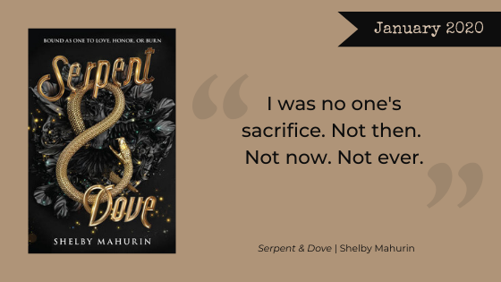

This month, we read Shelby Mahurin’s debut novel [*Serpent and Dove*](https://www.goodreads.com/book/show/40024139-serpent-dove), a tale of witches, magic, forbidden love, and centuries old prejudice in a historical France inspired world.

**Warning, Here Be Spoilers.**

<h2 class="utl-color--elizabeth">Beth</h2>

### 👓👓👓👓 3.5 / 5

I finished *Serpent & Dove* in under two days; suffice it to say I found it a compelling read. The romance was enough to sweep me along, although in retrospect we needed more motivation for the two leads to cast aside their long-held beliefs and fall for each other. The French-inspired setting and the magic system were cool. The fact magic came at a very real price was a device I wanted to see utilized more. Not being deeply familiar with witches, I was not sure how much of the world was the author’s invention and how much was drawn from established lore. The dual viewpoint worked pretty well, although there were spans of chapters from just one character or another for unclear reasons.

My biggest issue hit me at the end when the book flipped a switch from romance to ensemble cast…? The whole climax and ending felt rushed, primarily for this reason. There was one member of the (hastily formed) group who basically came out of nowhere, and the other characters who joined needed more build up throughout the novel. Overall, I thought this was a strong enough debut for me to consider checking out the author’s future works.

<h2 class="utl-color--mary">Mary</h2>

### 👓👓👓 3 / 5

I struggled with a review for this one because my feelings about the book vacillated between burning through pages with eager interest and setting the book down with an eye roll. Like many of the other nerd girls, I really liked the premise of the novel—romance, witches, and a Paris (like) setting—I’m IN! And I was super intrigued by a magic system with real consequences. But like Beth I would’ve loved for those consequences to have had a more significant impact on the story itself, and the focus on the lack-luster romance with seemingly little foundation didn’t really work for me. I like the personal growth the characters have to go through to make their relationships work, so I really enjoyed the end of the novel. But I wasn’t always sure how we were getting there. I also found the oppressive religious institution to be a little too on the nose. The overt “women are evil” messaging the novel pushes back against could use a dash a subtly in its presentation. All of that being said, I had fun reading this book and will probably read the sequel, as the stories last act really takes off!

<h2 class="utl-color--catherine">Catherine</h2>

### 👓👓👓 3 / 5

I have heard so many good things about this book, and it's all the hype on [#bookstagram](https://www.instagram.com/explore/tags/bookstagram). There is a beautiful cover, an intriguing summary, and like Mary I am HERE for books about witches. But sometimes a book comes along, and it just isn't written for you. I felt that way about *Serpent and Dove*–it wasn't for me.

I'm not going to complain about this book being a romance, because it's supposed to be a romance. However, I do not romanticize the idea of marriage, having been divorced. I also have a strong aversion to religious oppression. These two things meant that I kept focusing on plot devices and lost sight of the rich characters and intelligent magic system. There are a number of good things here, so decide on your own if it's worthwhile to you.

I do want to highlight that I think it is inappropriate to continue the harmful idea that pain during sex is just a fact for women. That’s not an okay thing to teach to young women.

**Trope Warning**: [Love Across Battlelines](https://tvtropes.org/pmwiki/pmwiki.php/Main/LoveAcrossBattlelines)

<h2 class="utl-color--lydia">Lydia</h2>

### 👓👓👓👓 3.5 / 5

I went into this book with no knowledge of what it was. I hadn’t even read the inside of the jacket cover before I started, so I had no expectations of what I would find. And what I found sort of… confused me.

I’m a huge romance fan, so the device of a forced marriage is nothing new to me. And I don’t mind that story, even sometimes enjoy it, when done well. But like the other Nerd Girls I found the romance a bit of a struggle in this book. I couldn’t really believe that Lou would be able to look past what Reid’s beliefs drove him to do, and I felt like Reid did an abrupt about-face towards Lou that didn't fit what I’d learned of his character before then. Lou’s friendship with Coco was the more compelling relationship story, rather than the romance.

The last third or so of the book was much more exciting and much more focused on the mythology of the world and that drew me in. It was different enough from the first part that it almost felt like I was reading two stories, both of which could have been great if either had been given more time to develop. I enjoyed that part enough that I will probably read the sequel, which I hope will spend more time on an ensemble cast and a richly imagined world, and less time on the confusing and unsatisfying romance.

---

*What were your thoughts about "Serpent and Dove"? Join the discussion on [Facebook](https://www.facebook.com/nerdgirlsbookclub) or Instagram [@nerdgirlsbookclub](https://www.instagram.com/nerdgirlsbookclub/).*
