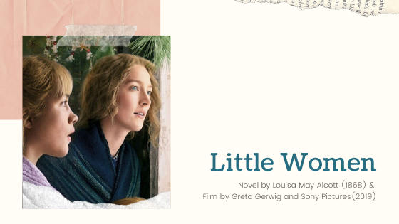

Image of Jo via <a href="https://www.sonypictures.com/">Sony Pictures</a>

As a book club for women, it feels inevitable that we gather together and see the new film adaptation of Louisa May Alcott's [Little Women](https://www.goodreads.com/book/show/1934.Little_Women). We went one step further, however, and decided to refresh our memories with a reread of the novel. Well, does the classic story of growing up in Civil War America live up to our nostalgia? Is the new film an explicit adaptation, or is it reimagined for the social context of 2019? Read below to hear our opinions.

**Warning, Here Be Spoilers.**

<h2 class="utl-color--mary">Mary</h2>

### 👓👓👓👓 3.5 / 5 Book | 👓👓👓👓👓 4.5/5 Film

I was really excited about *Nocturna* and had been looking forward to its release for a while. The description of the novel as a Latinx-inspired, magic driven heist drew me in immediately! The beginning of the novel is promising, and the potential for the story world and magic system is definitely there, but ultimately the novel fell quite short of these early high expectations. In regard to plotting, solutions to problems seemed too neat and easy, and the magic is often overly convenient. Really though, it was the lack of consistent character development that I got stuck on. Character motivations were often murky, disjointed, or down right frustrating, and the unique and exciting world the novel is set in couldn’t make up for the lack of depth in a love story that really didn’t need to be there.

<h2 class="utl-color--catherine">Catherine</h2>

### 👓👓 2 / 5 Book | 👓👓👓👓👓 4.5/5 Film

Well, the book was disappointing. It's a morally pious and often preachy story that has exactly one "successful" version of being a woman: married to someone who loves you, and with children. I know *Little Women* is a product of its time, and I should give it applause for how feminist it was for that age. And it is at times, extremely feminist! Despite my loathing of the overly religious tone, I was engaged with the writing, unlike a lot of classic literature (looking at you, Dickens). I feel a bit like a traitor to all the women who found this book foundational to their existence as "little women." Perhaps, like *Catcher in the Rye*, this novel is best read and enjoyed at a certain stage of life (that isn't 30 years old and unmarried).

Lamenting about my distaste for this novel one day, a good friend mentioned, “without groundwork from writers like Louisa May Alcott, women's stories wouldn't have the chance to be what they are today.” He was absolutely right; the only reason we get more accurate and plentiful stories about women is because a few authors “sold their heroine into marriage” (to quote 2019 Jo March).

I'm pleased to say the 2019 film adaptation is wonderful. So often the book is better than the movie; it’s a trope we bookish types know well. Surprisingly, [Greta](https://www.imdb.com/name/nm1950086/)’s script is fairly true to the novel. The same scenes happen, Marmie says a few lines word for word. Beth and Meg and Amy and Jo all feel like the same characters in the same story, and yet, the tone is wholly different. Thanks to just a few tweaks of language and a bit more context in the background (I won’t spoil it for you), the newest film version of “Little Women” is one of my favorite films of 2019.

<h2 class="utl-color--lydia">Lydia</h2>

### 👓👓👓👓 3.5 / 5 Book | 👓👓👓👓👓 4/5 Film

Ah, nostalgia. I read this book as a little girl, and remember loving it. As an adult, I’m not quite as big a fan. My memories of the book had become conflated with my memories of various film adaptations, and I had forgotten some of the parts of the story I didn’t like as much. Like many girls, I connected to Jo as a child, lost in my imagination and spending a lot of time scribbling stories. I even wrote plays and sometimes managed to rope people into helping perform them! During my reread, I can see why I connected so well to her in the first part of the book. The second part, which Alcott wrote under pressure from publishers and fans, did not draw me in as much as an adult. Rather than showing the “little women” growing into adults who kept the ambition they each displayed in childhood, the second half of the book felt like it was focused on them giving up their dreams, often at the urging of men. Although I know the book is a product of its time, I almost wish I had simply stuck with my nostalgic memories of reading it instead of revisiting it as an adult.

The movie, on the other hand, I loved. It had all the plot elements and was true to the original story, while at the same time being true to Alcott’s original vision for her “little women.” (My copy of the book had a thorough introduction that reviewed how she had hoped to have the March sisters’ stories end.) The structure of the movie enhanced the storytelling by giving context to the scenes in the book, and the ending…oh, the ending. It’s amazing, and I think if Louisa May Alcott were alive to watch it, she would love it as much as I.

---

*What were your thoughts about "Little Women"? Join the discussion on [Facebook](https://www.facebook.com/nerdgirlsbookclub) or Instagram [@nerdgirlsbookclub](https://www.instagram.com/nerdgirlsbookclub/).*
