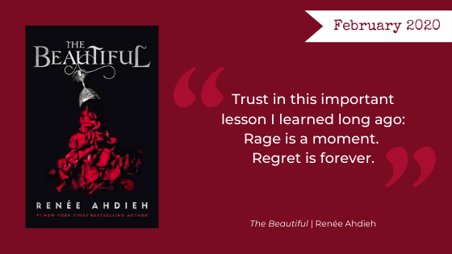

Oh, February. Spring will be here soon, separated from our frozen midwest dreams by at least another month of dreary winter. Speaking of cold bodies, this month's mini-reviews are for a lusty vampire read, *[The Beautiful](https://www.goodreads.com/book/show/42265183-the-beautiful)*. Before that, though, we'll discuss our Favorite Female Friendships for Galentines, and Beth will reflect on Alix E. Harrow's *[The Ten Thousand Doors of January](https://www.goodreads.com/book/show/43521657-the-ten-thousand-doors-of-january)*.

## February’s Book Club Pick

Please read along with us with our February book club pick, *The Beautiful* by Renée Ahdieh. As always join the discussion on [Facebook](https://www.facebook.com/nerdgirlsbookclub) and follow us on Instagram [@nerdgirlsbookclub](https://www.instagram.com/nerdgirlsbookclub/)!

From [Penguin Random House](https://www.penguinrandomhouse.com/books/551954/the-beautiful-by-renee-ahdieh/):

<blockquote>
Instant New York Times and Indie Bestseller!

New York Times bestselling author Renée Ahdieh returns with a sumptuous, sultry and romantic new series set in 19th century New Orleans where vampires hide in plain sight.

In 1872, New Orleans is a city ruled by the dead. But to seventeen-year-old Celine Rousseau, New Orleans is a safe haven after she’s forced to flee her life as a dressmaker in Paris. Taken in by the sisters of the Ursuline convent in the middle of the carnival season, Celine is quickly enraptured by the vibrant city, from its music to its fancy soirées and even its danger. She becomes embroiled in the city’s glitzy underworld, known as La Cour des Lions, after catching the eye of the group’s enigmatic leader, Sébastien Saint Germain.

When the body of one of the girls from the convent is found in Sébastien’s own lair–the second dead girl to turn up in recent weeks–Celine battles her attraction to Sébastien and suspicions about his guilt along with the shame of her own horrible secret.

After a third murder, New Orleans becomes gripped by the terror of a serial killer on the loose–one who has now set Celine in his sights. As the murderer stalks her, Celine finally takes matters into her own hands, only to find herself caught in the midst of an age-old feud between the darkest creatures of the night, where the price of forbidden love is her life.

At once a sultry romance and a decadent, thrilling mystery, master storyteller Renée Ahdieh embarks on her most potent fantasy series yet.
</blockquote>

Keep warm out there!

The Nerd Girls
