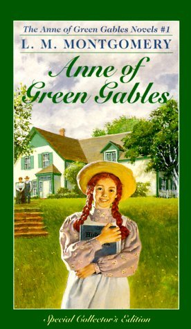

February is a month of love and heartbreak, commercialism, hallmark cards, polar vortices if you live in the States, and, hopefully, plenty of chocolate. February is also a month for one of our favorite Book Club traditions: Galentines. We love to celebrate our best gal pals this time of year, and that extends to the fictional. Here are some of our favorite female friendships, and why we (platonically) love these ladies. 

Images in this article via <a href="https://www.goodreads.com/">Goodreads</a>

<h2 class="utl-color--jane">Jane</h2>

### Katniss and Rue from Suzanne Collins's [*The Hunger Games*](https://www.goodreads.com/book/show/2767052-the-hunger-games)

I had to spend some time thinking about who my favorite lady friends are, which is honestly probably part a reflection of what I choose to read, but also partially a real problem with what is being published today. GIVE US SUPPORTIVE, LOVING, HELPFUL FRIENDS IN THE STORIES YOU WRITE!
Anyways. I digress. I’m going with Katniss and Rue from Hunger Games. I just recently reread the trilogy when the news of the prequel dropped. I could have picked Katniss and Primrose too, but I loved the purity and complexity that Katniss and Rue experienced with one another. Something about being in such a dire situation pushed them into each other’s orbit, but their humanity is what bonded them to one another. Their fast bond showed women at our best: supporting each other and at times sacrificing our well-being and personal interests to help our friends. I also loved that their bond carried on past Rue’s death. What a beautiful testament to lady friends!

<h2 class="utl-color--mary">Mary<h2>

### Karou and Zuzana from Laini Taylor’s [*Daughter of Smoke and Bone*](https://www.goodreads.com/book/show/8490112-daughter-of-smoke-bone)

I may be biased because I am obsessed with these characters individually...and this series… and honestly anything Laini Taylor touches in general, BUT I love Zuzana and Karou's intense and supportive friendship.  I especially appreciated the ways that it grows, becomes strained, and overcomes throughout the series. Warning! Slight Spoilers Ahead for the DoSB series! Zuzana and Karou start out as supportive best friends, helping each other through difficult times and hanging out sharing their love of art. However, what makes them my favorite female friendship is their commitment to each other in the face of seemingly insurmountable odds, severe physical and emotional toil, and (the most threatening of all) new relationships. They accept each other in all of their otherness and in all their flaws and Zuzana especially is willing to give everything for Karou, who must learn to accept the love and support of another and make difficult choices to keep her safe.

<h2 class="utl-color--catherine">Catherine</h2>

### Jasnah and Shallan from Brandon Sanderson's [*The Way of Kings*](https://www.goodreads.com/book/show/7235533-the-way-of-kings)

Okay, hear me out here. I recognize that the one and only Brandon Sanderson isn't the best candidate for a month celebrating women's friendships, but he's here and he didn't do a terrible job.

In *The Way of Kings*, Jasnah Kholin, headstrong, aloof, heretic princess, and brilliant scholar, takes lower noble lady Shallan Davar as an apprentice. Jasnah sees unlocked potential in Shallan, and Shallan's need for Jasnah's support is literally life and death. Though their relationship is initially based on a number of extreme and clever lies, this pair of extraordinary women find each other and create balance. Jasnah's high expectations and strict study force Shallan to be her best self, and Shallan's quick wit and thoughtful perspective slowly thaw the ice of Jasnah's cool demeanor. These two are one of my favorite female friendships, because combined they become their best possible selves.

<h2 class="utl-color--lydia">Lydia</h2>

### Anne Shirley and Diana Barry from L.M. Montgomery's [*Anne of Green Gables*](https://www.goodreads.com/book/show/763588.Anne_of_Green_Gables)

I’m kicking it way back for this one. Yes, it’s a pretty cliche choice, but I have reasons! Anne and Diana weren’t just friends, they were *bosom* friends. Best friends forever before there were BFFs. Anne and Diana’s friendship blossomed because they made it do so. They were different in many ways, and often envious of some of those differences (Anne wished for Diana’s black hair and good looks and her fashionable clothes, Diana wished she had Anne’s imagination), but that envy never came between them. They celebrated their differences and celebrated each other’s accomplishments. They were unhesitating in giving compliments. They doled out criticism to each other when needed, but were always careful that such statements came from a place of love. And they fought for their friendship as best they could. When Diana’s mother forbade them to socialize, they kept each other in their hearts and were able to pick up where they left off when Mrs. Barry lifted her ban. There are plenty of examples of petty bickering between girls in Anne’s class, and Anne herself was entirely capable of holding a grudge, but Anne and Diana never fell victim to pointless fighting.

Anne and Diana represented everything I wanted in my own friendships when I was a girl, and drove me to work to make that happen. Their example is in many ways responsible for the types of friends I have today, so they will forever be my Galentine's OTP.

---

*Who are your favorite gal pals? Join the discussion on [Facebook](https://www.facebook.com/groups/566114107531110/) or Instagram [@nerdgirlsbookclub](https://www.instagram.com/nerdgirlsbookclub/).*
