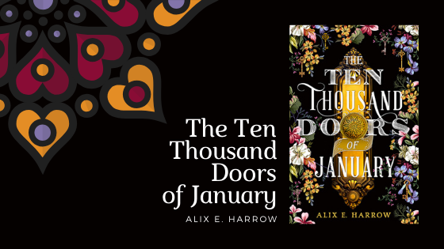

<blockquote class="utl-blockquote--elizabeth">
"But you still know about Doors, don’t you? Because there are ten thousand stories about ten thousand Doors, and we know them as well as we know our names. They lead to Faerie, to Valhalla, Atlantis and Lemuria, Heaven and Hell, to all the directions a compass could never take you, to <i>elsewhere</i>."
</blockquote>

Alix E. Harrow's *[The Ten Thousand Doors of January](https://www.goodreads.com/book/show/43521657-the-ten-thousand-doors-of-january)* starts with a girl, a book, and a little magic. Beth takes us on a journey through ten thousand doors. Heads up, we're going to be talking spoilers.

Title: *The Ten Thousand Doors of January*

Author: Alix E. Harrow

Published: September 2019, Redhook

Genre: Fantasy, Magical Realism, Historical Fiction

<h2 class="utl-color--elizabeth">Beth's Thoughts</h2>

What I found notable about Alix E. Harrow’s debut novel *The Ten Thousand Doors of January* was the fact that the premise and themes seemed both familiar and fresh at the same time. We have all climbed into the wardrobe and stepped through the looking glass before, after all. While there is nothing new about this premise, this was an original spin on a well-loved idea. Harrow pulls this off quite well with compelling characters, layered narratives, and well-executed reveals.

This book has been praised as a love letter to stories, and I couldn’t agree more. *The Ten Thousand Doors of January* earned a high place on my TBR when it first popped up on my Goodreads feed. There was just something mesmerizing about the title and cover—right there is an enchanting yellow door ready for us to step through. What is a book, after all, if not a door to another world?

The main narrative focuses on January Scaller coming of age in the early 1900’s. January is a self-described “in-between” person, with a white mother she’s never known and a black father who keeps disappearing for extended periods of time. She’s raised in a mansion as the ward of the wealthy Mr. Locke, her father’s employer, and as such is granted many comforts and privileges, even the opportunity to travel first-class around the world. The dissonance between her race and her place in society confuse the people she encounters—are they to treat her as human, or something less than? Of course her place in life is precarious, dependent completely upon the goodwill of her benefactor.

When January finds her first door, she’s cowed into submission. But over the years the tug of other worlds, of *elsewhere*, becomes too strong.

January’s is not the only story we get to know. One of the gifts she receives by way of a mysterious artifact in Mr. Locke’s collection is a journal entitled The Ten Thousand Doors. The reader is treated to chapters of this book interspersed with the main tale. After January finds her first door to another world, she reads of the adventures of two other world travelers who have done the same. Over time we come to understand how their stories interlock with January’s own.

Together with January we step in and out of countless doors, pulling back the veil and discovering how the world works. We cheer for January as she discovers her own power—often at great cost—and puts it to use. The layered mysteries work off one another, and some misdirection keeps the reader guessing at the true nature of the villains. Reading the journal entries alongside our heroine, we are able to piece together many of the puzzles alongside her.

Other characters include January’s trusty dog Bad, who is not timid about biting people who deserve to be bitten, and one of the most badass side characters I’ve encountered, Jane. Part of me wishes we saw (much, much) more of Jane, but at the same time there’s enough on the page my imagination to fill in a whole novel’s worth of her adventures. We also encounter a love interest, but the love story here does not hold up to the epic we see play out in the journals.

The language of this novel itself is beautiful. I appreciate it doesn’t trip over itself. The prose keeps the action moving, while allowing for pauses in which we may appreciate resonances within the story itself and to reflect on universal truths.

This book will appeal to fans of literary fiction, magical realism, Strong Female Characters™, and anyone who loves stories. It is a door I recommend stepping through.

<blockquote class="utl-blockquote--elizabeth">“It’s believing that matters, remember.”</blockquote>

---

*What did you think of "The Ten Thousand Doors of January"? Join the discussion on [Facebook](https://www.facebook.com/groups/566114107531110/) or Instagram [@nerdgirlsbookclub](https://www.instagram.com/nerdgirlsbookclub/).*
