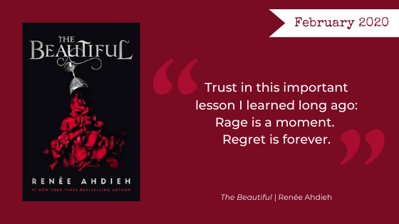

**CW: This novel includes references to rape and sexual assault.**

This month the Nerd Girls picked up a highly anticipated new release, [*The Beautiful*](https://www.goodreads.com/book/show/42265183-the-beautiful) by Renée Ahdieh, that promised to tug at our vampire-loving-heartstrings. What we wanted was steamy (potentially problematic) human-undead romance in a bygone era of eccentric gatherings and enviable extravagance. What we got was, well, wasn’t exactly what we expected.  

**Warning, Here Be Spoilers.**

<h2 class="utl-color--elizabeth">Beth</h2>

### 👓👓👓 3 / 5

I remember being absorbed in Renée Ahdieh’s debut *<a href="https://www.goodreads.com/book/show/18798983-the-wrath-and-the-dawn">The Wrath and the Dawn</a>*. I am not sure what I expected from *The Beautiful*, but it was not a similar experience and I’m still trying to discern why. On a sentence level the writing was strong, the imagery evocative. There was definitely a love letter to New Orleans threaded in there. For some reason, however, I failed to connect to the characters. They seemed to be doing things because they read the script as opposed to driving the action themselves. I found the characterization of Celine, our protagonist, to be a bit muddled, and perhaps obfuscated by the multiple viewpoints. The proportion of Bastien’s POV chapters seemed off (he was not a co-main character, exactly, except he was?) The love story was not executed in a way I found compelling. Overall, I was left somewhat confused by the villains and their motivations.
I am not a vampire person—I just can’t romanticize some guy who’s hundreds of years too old for the teenaged/twenty-something heroine. Anyone who picks up the sequel will have to see where Ahdieh goes with the tropes next; I think she has the potential to pull off some interesting twists.

<h2 class="utl-color--mary">Mary</h2>

### 👓👓 2 / 5

I have to be honest: this one didn’t work for me, personally. To be totally fair, I was pretty hyped for the release of this book because I LOVE a good vampire story. Like, rewatch *The Vampire Diaries* once a year, was enraged by the end of *True Blood*, even will admit to finding problematic joy in *<a href="https://www.goodreads.com/book/show/41865.Twilight">Twilight</a>* at times, love vampire stories. So, I might have brought some unrealistic and unfair expectations into my reading experience. Ultimately though, despite a lush setting, beautiful costumes, and an intriguing premise, the underdeveloped cast of characters, twists that fell flat, and cringy dialogue (not even getting into the sexual politics of the novel) left me less than interested in pursuing the sequel.

But, even after all that, I might still give it a chance as I really liked Ahdieh’s other series, *<a href="https://www.goodreads.com/book/show/23308087-flame-in-the-mist">The Flame in the Mist</a>* and *<a href="https://www.goodreads.com/book/show/18798983-the-wrath-and-the-dawn">The Wrath and the Dawn</a>*, and generally enjoy her writing!

<h2 class="utl-color--lydia">Lydia</h2>

### 👓👓👓 3 / 5

*The Beautiful* wasn’t what I was expecting, based on the book jacket. Instead of a steamy vampire romance, we got a repetitive collection of scenes that didn’t really give me a good sense of any of the characters. There were a lot of tantalizing strings to pull, so many stories to tell...but Renée Ahdieh didn’t actually pull or tell any of them. Celine’s feelings about her mixed heritage, her relationship with her father, her desire to have power over her own life, the mythology of The Brotherhood and The Fallen, were all teased, but never developed. I also didn’t get a good sense of the attraction between our two leads, other than their mutual appreciation for Shakespeare (which was strangely presented as if it were something unique and unexpected). The anachronistic attitude and speech of the main characters also threw me. I appreciated some of what they said and did (Celine told Bastien to stay away, and he *did*! No creepy stalking dressed up as sexy romance!), but I have to wonder if maybe it would have been better set in more modern times.

I didn’t see the ending “twist” coming, but I also didn’t understand it, find it meaningful or shocking, or feel like there was any foreshadowing…mostly, I thought, “huh?” While I read the book quickly and I can see the potential for a sequel, to me it seemed to lack direction and felt more like a debut novel than a book from an established author. I didn’t hate it, but I probably won’t be reading any sequels.

<h2 class="utl-color--catherine">Catherine</h2>

### 👓👓👓 3 / 5

I am giving this one a very generous three stars, solely because my list of two-star books is full of terrible reads, and *The Beautiful* is by no means a terrible read. Let's go over what I liked and didn't like.

Stories with memorable imagery are always my favorite, and this one has two or three grand, themed parties that certainly fit the bill. I loved the detail of costuming from Celine’s perspective, and beyond that, I adored that Celine wished to be a dressmaker and support herself. I enjoyed Odette as a character immensely, I would have liked to learn more about her and her faults and dramas. I am also enthralled (heh heh) by lore where vampires gain individualistic additional superpowers after they are turned (yes, like in *Twilight*).

For things I didn't like: I have no idea who the side characters were. I could barely tell them apart by the time the first one died. Odette was the only one who really stood out for me, and honestly, she should have been the protagonist of this novel. The lucious New Orleans setting felt totally wasted, and, as Lydia said, the characters were anachronistic and modern.

The final nail in this *vampire coffin* is also this month's **Trope Warning**: <a href="https://tvtropes.org/pmwiki/pmwiki.php/Main/RapeAsBackstory">Rape as Backstory</a>. I am so, so tired of books about women whose single prominent personality trait is based on rape.

<h2 class="utl-color--jane">Jane</h2>

### ? / 5

I got a bit behind on reading. By the time I actually got the book, the other Nerd Girls told me to just skip it and move on to the next one. So. I have no review other than that I didn’t even bother picking it up.

---

*What were your thoughts about "The Beautiful"? Join the discussion on [Facebook](https://www.facebook.com/nerdgirlsbookclub) or Instagram [@nerdgirlsbookclub](https://www.instagram.com/nerdgirlsbookclub/).*
