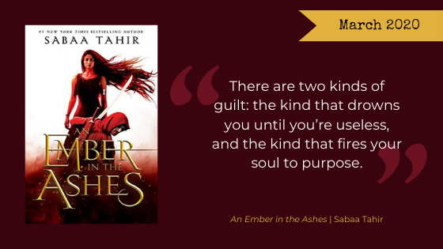

It’s March. As a teacher, this is a month I often dread, with no breaks and lots of rain/snow/ice/whatever else the midwest weather gods decide to throw at us. But what’s one thing that always makes the dreary weather more bearable? Good books of course!

This month, we’re reading the first book in Sabaa Tahir’s super popular series, *[An Ember in the Ashes](https://www.goodreads.com/book/show/27774758-an-ember-in-the-ashes)*. Before that, Lydia will review *[Gideon the Ninth](https://www.goodreads.com/book/show/42036538-gideon-the-ninth)* (a book club favorite!) and we’ll all share some of the required reading from our school days that we ACTUALLY enjoyed. What’s the best book you’ve ever been forced to read? Let us know!

## March Book Club Pick

Read along with our March book club pick, *An Ember in the Ashes* by Sabaa Tahir and as always, join the discussion on Facebook and follow us on Instagram [@nerdgirlsbookclub](https://www.instagram.com/nerdgirlsbookclub/)!

From [Penguin Random House](https://www.penguinrandomhouse.com/books/317030/an-ember-in-the-ashes-by-sabaa-tahir/):

<blockquote>
**Laia is a slave. Elias is a soldier. Neither is free.**

Under the Martial Empire, defiance is met with death. Those who do not vow their blood and bodies to the Emperor risk the execution of their loved ones and the destruction of all they hold dear.

It is in this brutal world, inspired by ancient Rome, that Laia lives with her grandparents and older brother. The family ekes out an existence in the Empire’s impoverished backstreets. They do not challenge the Empire. They’ve seen what happens to those who do.

But when Laia’s brother is arrested for treason, Laia is forced to make a decision. In exchange for help from rebels who promise to rescue her brother, she will risk her life to spy for them from within the Empire’s greatest military academy.

There, Laia meets Elias, the school’s finest soldier—and secretly, its most unwilling. Elias wants only to be free of the tyranny he’s being trained to enforce. He and Laia will soon realize that their destinies are intertwined—and that their choices will change the fate of the Empire itself.
</blockquote>

Happy reading!

The Nerd Girls
