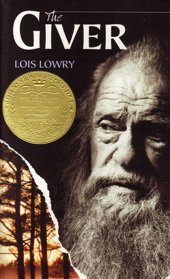

We’ve all been there: you’re sitting in your English classroom being handed yet another old book you’ve got to figure out how to get through without falling asleep. But, what’s this? You open it up, read a few pages and, amazingly, don’t immediately want to throw the book across the room! If you’re anything like us, dear reader, you’ve found more than one book on the required reading list that’s drawn you in, made you cry, or kept you awake at night. Today, we’re sharing a few of our favorite required reads.

Have a book someone once forced you to read that turned into a favorite? We’d love to hear about it!

Images in this article via <a href="https://www.goodreads.com/">Goodreads</a>

<h2 class="utl-color--jane">Jane</h2>

### [*The Giver* by Lois Lowry](https://www.goodreads.com/book/show/3636.The_Giver)

I had a surprisingly hard time picking JUST ONE of my favorite books. I have loved reading for as long as I can remember, and being an English major means I read more than most in the context of a school setting. I also always read the assigned reading, something I didn’t know was unusual until my high school friends poked fun at me for actually reading what I was supposed to. 

We read Lois Lowry’s *The Giver* in fifth grade. I’m not sure I fully grasped all of the aspects of the book then, but I knew I loved the plot and was absolutely gripped by the decisions Jonas was forced to make. This was the first dystopian novel I ever read, and it was one of the first science fiction books I read on my own. As I’m sure was the intention of my teacher, I was forced to grapple with my own perceptions of what makes someone good or bad, nice or mean, kind or cruel. While reading, I completely ignored the timeline my teacher gave us and devoured it in a couple of nights. I still read *The Giver* about once a year, partially because it’s message is still poignant and necessary and partially because my nostalgia keeps bringing me back to it.

<h2 class="utl-color--elizabeth">Beth</h2>

### [*The Catcher in the Rye* by J.D. Salinger](https://www.goodreads.com/book/show/5107.The_Catcher_in_the_Rye)

A relatively small selection of books have survived all my moves over the years, among them J.D. Salinger’s *The Catcher in the Rye*. I had it assigned more than once during high school and college, including for a religious studies course entitled Quest for Human Destiny (what better place, after all, to discover the meaning of life than in the pages of great literature?).

There are certain books guaranteed to stick with you if you read them at the right time. I initially read *Catcher* at the right time, and upon re-reading it I found my adult self readily sucked in by Holden Caulfield’s hypnotic voice yet again. When, scattered among all his diatribes against phonies, Holden dropped an especially profound aside, I had to consciously stop myself and go over it.

Holden’s voice rings capital-T True. He’s a confused, depressed teenager on the cusp of adulthood. He’s seeking distraction and escape from his negative thoughts, he’s seeking connection and validation from others, and all the while he can’t keep himself from pulling out his most painful memories.

I have always found stories centering on the loss of innocence particularly captivating. This only becomes truer the older I get. I believe our would-be preserver of innocence Holden Caulfield deserves his place in the American canon.

<h2 class="utl-color--mary">Mary<h2>

### [*Their Eyes Were Watching God* by Zora Neale Hurston](https://www.goodreads.com/book/show/178805.Their_Eyes_Were_Watching_God)

<blockquote class="utl-blockquote--mary">
“Ships at a distance have every man's wish on board. For some they come in with the tide. For others they sail forever on the same horizon, never out of sight, never landing until the Watcher turns his eyes away in resignation, his dreams mocked to death by Time. That is the life of men. Now, women forget all those things they don't want to remember, and remember everything they don't want to forget. The dream is the truth. Then they act and do things accordingly.”
</blockquote>

I went to an all girls school for high school and while I didn’t realize or appreciate it at the time, this meant I got to read an atypically large amount of fiction written by women. While there are a number of  favorites I could pull from here that have remained influential components of my literary life (Austen, the Brontes, Toni Morrison) I have to return to a book I fell in love with after the first paragraph (quoted above): *Their Eyes Were Watching God*. Hurston’s prose is painstakingly beautiful, melding a southern vernacular with poetic prose narration that “knocked something off of the shelf” inside of *me* and Janie’s search for her own horizon, that far off place where dreams wait just out of reach, affects me to this day.

<h2 class="utl-color--catherine">Catherine</h2>

### [*1984* by George Orwell](https://www.goodreads.com/book/show/40961427-1984)

I read *1984* in tenth grade. And then I immediately read it again. Then I read [*Animal Farm*](https://www.goodreads.com/book/show/170448.Animal_Farm). And [*Slaughterhouse-Five*](https://www.goodreads.com/book/show/4981.Slaughterhouse_Five). [*Brave New World*](https://www.goodreads.com/book/show/5129.Brave_New_World). [*A Clockwork Orange*](https://www.goodreads.com/book/show/41817486-a-clockwork-orange). [*Fahrenheit 451*](https://www.goodreads.com/book/show/13079982-fahrenheit-451). [*V for Vendetta*](https://www.goodreads.com/book/show/5805.V_for_Vendetta). I was absolutely hooked on classic dystopian literature. I was 15, and for the first time, I started to question the system around me. What if our government doesn't trust us? What if we shouldn't trust them? What if my interpretation of the world is fundamentally flawed?

Yeah, 1984 is a mess. Its characters aren't very deep or likable, the world is small and almost ridiculous, and the overall theme is *bleak*. However, I was assigned to read it when my teenage self was starting to critically examine everything I had been taught. My eyes were opened to a whole different world of speculative paranoia.

<h2 class="utl-color--lydia">Lydia</h2>

### [*The Count of Monte Cristo* by Alexandre Dumas](https://www.goodreads.com/book/show/7126.The_Count_of_Monte_Cristo)

No surprise here if you’ve read my bio, but my choice is *The Count of Monte Cristo*. Mrs. Group showed a lot of ambition for us when she assigned it to my class in 7th grade. It’s a hefty book with a lot going on, but I guess she knew what she was doing, because I not only enjoyed reading it, but have since decided it’s one of my favorite books.

I love a good revenge story. I especially love revenge stories where the person seeking vengeance does so cleverly. It’s particularly satisfying that the Count/Edmond Dantes tailors each part of his revenge to the individual receiving it. The initial part of the book, with his time in prison, is just as compelling. I love the idea that his prison education, and the fortune he learned about while in there, is the reason he was able to pass himself off as a count when he reentered society.

I’m not sure what it says about me that I enjoy his vengeance so much, but I can’t help but be grateful that Mrs. Group forced me to read something other than science fiction when I was twelve.

---

*What books were you forced to read in school? Join the discussion on [Facebook](https://www.facebook.com/groups/566114107531110/) or Instagram [@nerdgirlsbookclub](https://www.instagram.com/nerdgirlsbookclub/).*
