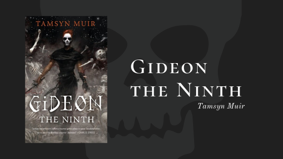

Lesbian. Space. Necromancers. Tamsyn Muir's *[Gideon the Ninth](https://www.goodreads.com/book/show/42036538-gideon-the-ninth)* is one of our favorite books so far this year. Here is Lydia's take on the hilariously bleak adventure. This post, as always, will have spoilers.

## Summary

Title: *Gideon the Ninth*

Author: Tamsyn Muir

Published: September 2019, Tor Books

Genre: Horror, Science Fiction

<blockquote class="utl-blockquote--lydia">
The Emperor needs necromancers.

The Ninth Necromancer needs a swordswoman.

Gideon has a sword, some dirty magazines, and no more time for undead nonsense.

Tamsyn Muir's *Gideon the Ninth* unveils a solar system of swordplay, cut-throat politics, and lesbian necromancers. Her characters leap off the page, as skillfully animated as arcane revenants. The result is a heart-pounding epic science fantasy.

Brought up by unfriendly, ossifying nuns, ancient retainers, and countless skeletons, Gideon is ready to abandon a life of servitude and an afterlife as a reanimated corpse. She packs up her sword, her shoes, and her dirty magazines, and prepares to launch her daring escape. But her childhood nemesis won’t set her free without a service.

Harrowhark Nonagesimus, Reverend Daughter of the Ninth House and bone witch extraordinaire, has been summoned into action. The Emperor has invited the heirs to each of his loyal Houses to a deadly trial of wits and skill. If Harrowhark succeeds she will become an immortal, all-powerful servant of the Resurrection, but no necromancer can ascend without their cavalier. Without Gideon’s sword, Harrow will fail, and the Ninth House will die.

Of course, some things are better left dead.
</blockquote>

via <a href="https://publishing.tor.com/gideontheninth-tamsynmuir/9781250313195/">Tor</a>

<h2 class="utl-color--lydia">Lydia's Thoughts</h2>

I was trying to classify *Gideon the Ninth* for a friend, and the best I could do was “It’s a macabre space necromancy story about a competition to find a Chosen One, with a dash of *[And Then There Were None](https://www.goodreads.com/book/show/16299.And_Then_There_Were_None)*.” This a book that defies classification and expectations, and I loved everything about it.

For one thing, it’s the sidekick’s story. We read so many stories about the teenage hero trying to be the last one standing, the one chosen…and that’s not Gideon. Gideon’s the not-so-faithful companion to that hero (though hero is probably debatable here. Maybe protagonist is better?). There’s a LOT happening behind the scenes that we the readers don’t understand, because Gideon doesn’t understand it. Even when things get explained, there are still holes in our knowledge because they are things that Gideon doesn’t care about. And I LOVE that. Somehow, in a book about space necromancy, that rings truer than the primary character in many other books I’ve read. That said, you REALLY have to trust that all will become clear with time.

Part of the reason the story is so compelling is Gideon herself. She’s snarky. She’s sometimes lazy. She’s so very REAL. She’s not the typical protagonist, holding herself to a higher ideal because That’s How It’s Done. Her moral code doesn’t fit neatly into the black and white world that a lot of other novels have. She has a moral code, but it’s entirely hers. What she does, or doesn’t do, is entirely informed by what she thinks is best for herself—and occasionally for those she cares about—in the moment, and if she doesn’t have an opinion on that, well, there’s a good chance she won’t do anything. And that just makes her a much more true to life character for me.

The book also boasts an incredible cast of additional characters. When you have an ensemble cast and only one POV character, it’s sometimes hard to wrap your head around them all. But Muir does a great job of helping us distinguish all the characters, even as we only see them through Gideon’s eyes. They are fun. They are interesting. They are annoying, or intimidating, or terrible, or attractive. But as you read, you grow a little more attached to each of them, as Gideon herself does, so when the dying starts, it’s that much more painful.

All of the above would be reason enough to love this book. But add to that the relationship between Gideon and Harrow, and this book catapults into 5-star status for me. I’m not always a fan of love-hate relationships, but it’s just done SO WELL. Their codependency makes sense, given how their childhood played out. Despite Gideon’s attempts to escape Harrow—no spoiler here, as it’s how the book opens—it’s clear she doesn’t really know how to exist in a world without her. And Harrow clearly feels the same way, and fights it. Watching the two of them come to trust each other, to share things with each other, and to be just a little more honest about how each of them feels is so fulfilling.

While I’m not completely in love with the ending, I have high hopes for how it will pay off as the rest of this trilogy plays out. Luckily for me, the next book is due to be published right around my birthday, just in case anyone out there is looking for a gift idea!

---

*What did you think of "Gideon the Ninth"? Join the discussion on [Facebook](https://www.facebook.com/groups/566114107531110/) or Instagram [@nerdgirlsbookclub](https://www.instagram.com/nerdgirlsbookclub/).*
