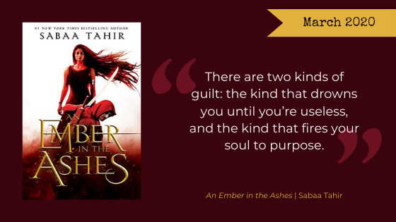

[*An Ember in the Ashes*](https://www.goodreads.com/book/show/27774758-an-ember-in-the-ashes) by Sabaa Tahir is one of the few books every member of our book club, without exception, adores. Here are our thoughts about this month's read.

**Warning, Here Be Spoilers.**

<h2 class="utl-color--elizabeth">Beth</h2>

### 👓👓👓👓👓 5 / 5

I loved this book. Loved it. ABSOLUTELY ADORED IT. As soon as I finished this book I ordered the second one because I just had to know what happened next. I love a good love triangle, especially one with twists, turns and surprises. I honestly switched back and forth through the course of the book who I wanted to end up together. Sabaa Tahir created an arc that kept me captivated, curious and completely surprised by what happened next. And after having read the next two books in the series, I can confirm that continues in the subsequent iterations.

I fell in love with the world Tahir created, not because of its beauty, but more of its horrors. The world our characters find themselves in is BLEAK, especially for anyone except the Masks. The juxtaposition of the darker elements of the world just made the love the characters found for each other (romantic, familial, friendships and more) that much more beautiful. Hope is what compelled me through this book. Hope for the characters I grew to love and hope for the world they lived in to overturn the systems of oppression that exist for a better, more fair, more loving world. Now, whether that comes to fruition is another thing altogether and has me hooked for the whole series waiting to find out.

<h2 class="utl-color--elizabeth">Beth</h2>

### 👓👓👓👓👓 5 / 5

*An Ember in the Ashes* was on my radar long before it was a book club selection. It’s hard not to put extra pressure on books that have been met with so much acclaim. In fact, I would rather stumble upon a great novel than face disappointment when a book falls short of my expectations. Luckily Sabaa Tahir is a fantastic storyteller and her debut lives up to the hype.

Novels with multiple POVs pull it off to varying degrees of success. The dual narrative in *Ember* is executed effectively. The characters have clear motivations driving them and propelling the story forward, and the relatively short, action-packed chapters keep the tension up. The world is fully realized without getting bogged down in tracts of lengthy backstory or description. Many of the secondary characters—antagonists, allies, and those in-between—come to life.

I must say I was horrified by some of the darker things the characters have to endure, notably the Third Trial. Wow. That scene really stuck with me after I finished the book.
I plan to pick up the sequel very soon!

<h2 class="utl-color--mary">Mary</h2>

### 👓👓👓👓👓 5 / 5

AHHHH THIS BOOK! I love it! It was truly so compelling that I constantly found myself speed reading and having to go back and slow down so I wouldn’t miss anything. And I definitely didn’t want to miss *anything*!

I love the dual perspectives of this novel and the way it plays with the gray areas and the people who are stuck in them (an idea that only gets better as the series continues!). Laia and Elias are both compelling characters and I never once felt that slight deflation you get from switching POV characters in the middle of the action. Y’all I didn’t even mind the love triangle because, like everything else in this book, IT'S NOT THAT SIMPLE! Sabaa Tahir is CRUEL in the best possible ways (if you follow her on Twitter while waiting for a book to release you know what I mean!). The joy, sorrow, panic, anger, confusion, etc. that I felt while reading this book were so real because I actually believe that bad things can happen to characters in her books. If you haven’t already, READ THIS BOOK! And the next one, and the one after that. They really live up to the hype.

<h2 class="utl-color--catherine">Catherine</h2>

### 👓👓👓👓👓 5 / 5

I love, love, love this book, and its two sequels. I enjoy the fantasy aspect, and the clearly Roman influence. Laia is an incredible point of view; she's your typical "strong female fantasy heroine," except she has flaws. Laia feels tremendous guilt at the loss of her sibling, and her lack of self-preservation leaves her in difficult circumstances.

Elias is also an interesting character, though I find him to be more typical of the genre. His friendship with Helene is potentially one of my favorite aspects of the entire series. The trials the two go through give me enough *[The Hunger Games](https://www.goodreads.com/series/73758-the-hunger-games)* nostalgia without feeling derivative.

There is, of course, a number of hefty tropes (* cough * Helene's entire background), the largest being the dreaded **[Love Triangle(s)](https://tvtropes.org/pmwiki/pmwiki.php/Main/LoveTriangle)**. But hey, I'm here for it.

<h2 class="utl-color--lydia">Lydia</h2>

### 👓👓👓👓👓 4.5 / 5

I reread this book to be able to write this review, and even though I knew I really liked it, I’d forgotten just how good it is. There are just so many things Sabaa Tahir did right. Laia is an amazing protagonist; I love that she lacks the basic skills for the task she’s been given and that her first instinct is to run from danger. And I love that she pushes past that because what drives her is so important. No matter what else is thrown her way, she never loses sight of her goal. I enjoy her relationship with Elias—though, just once, can’t we have a platonic relationship between our two leads?—and I’m okay with the love triangle (quadrangle?), even when it’s not my favorite storyline. I particularly enjoy that when we meet Elias, he is already questioning his future; it isn’t some change miraculously brought about by meeting Laia. His relationship with Helene is amazing and complicated.

But most of all, I really appreciate that Tahir planted so many little seeds that bear fruit in the later books. There’s something so wonderful about a well planned story, one where rereading a book gives you a little thrill of discovery as you realize all the hints you missed the first time through. I’m really looking forward to the continuation of this series.

---

*What were your thoughts about "An Ember in the Ashes"? Join the discussion on [Facebook](https://www.facebook.com/nerdgirlsbookclub) or Instagram [@nerdgirlsbookclub](https://www.instagram.com/nerdgirlsbookclub/).*
