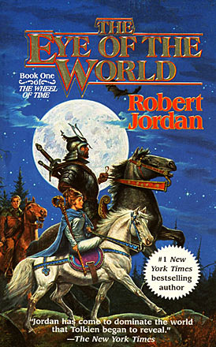
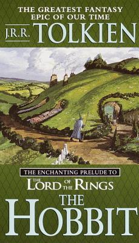
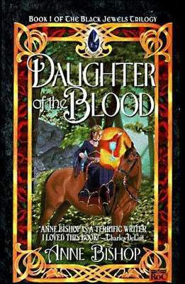

Oh boy. It’s 2020. As a group of liberal white women, we’ve been pushing the feminist agenda for years. And, as a group of liberal white women, there are quite a few mistakes and stereotypes we’ve fed into and been fed in our lives. There is also a lot of pressure to see everything with a feminist lens, and that definitely applies to our consumption of media–I mean, have you tried watching *The Lego Movie* with a purely feminist perspective? Ruined. However, we’ve all let our liberal agenda slip a bit now and then, and here is our list of Problematic™ reads we enjoy despite their many flaws.

Images in this article via <a href="https://www.goodreads.com/">Goodreads</a>

<h2 class="utl-color--jane">Jane</h2>

### [*The Harry Potter Series*](https://www.goodreads.com/book/show/3.Harry_Potter_and_the_Sorcerer_s_Stone) by J.K. Rowling

To be clear, I actually don’t think there are many things problematic with the canon 7 novels in the original series. HOWEVER, since their release, basically every supplemental text (Fantastic Beasts movies, Cursed Child, etc) has worked to undermine and raise incredible problems for the original texts themselves. I still love the series and read it through about once a year, but it's taken on a new sheen.

This is especially true when, randomly, laws and rules governing magic are inexplicably changed in the new works. There are also questions raised about some of our favorite characters. (Why is Harry such a bad father in Cursed Child? He seemed so nice last time we saw him! And what is happening in the Dumbledore bloodline? Who are these random new people who have never been brought up before?) All of these new questions just make me work REALLY HARD while reading to stop thinking in between the lines as to what else is false in the original books. So, yeah, they’re definitely problematic to me. 

(Also, J.K. Rowling has said some INCREDIBLY problematic things both on her own and in relation to these texts. Instead of going on a long rant, I’m just including it here as a note that is also a reason for me to place this in the problematic category.)

<h2 class="utl-color--mary">Mary<h2>

### [*The Wheel of Time Series*](https://www.goodreads.com/book/show/228665.The_Eye_of_the_World) by Robert Jordan

Jordan’s sweeping (often tedious) 14 book epic high fantasy has hordes of die-hard fans. And just as many critics. I LOVED these books in highschool. They were the first fantasy series I’d found on my own and the first world outside of Harry Potter and the Lord of the Rings that I could completely immerse myself in, and I dove head first and never looked back. As an adult, however, I definitely did look back, and I wasn’t super excited about what I found.

Not surprisingly, this series has a major gender issue. Yes, there are female characters. And yes, they can be very powerful (as long as they’re not *too* powerful). But the sexual and gender politics in those representations are TOUGH to look back at. The relationship between gender and magic that the story creates is inherently positioning them as opposites, with the women’s being easier to control and thus less powerful/dangerous. And of course, there is the love...square? I will let a braver reviewer unpack that one, but it's enough to say that the book's sexual politics are fraught at best.

And yes, before you ask, I’m still going to watch the Amazon show because that’s the kind of masochist I am…

<h2 class="utl-color--catherine">Catherine</h2>

### [*The Hobbit*]() by J.R.R. Tolkein

J.R.R. Tolkein's [The Hobbit](https://www.goodreads.com/book/show/15329.The_Hobbit), and of course the entire [The Lord of the Rings](https://www.goodreads.com/book/show/33.The_Lord_of_the_Rings) trilogy, is necessary for an epic fantasy fan like me. You'd be hard pressed to find any piece of fantasy media in 2020 that did not take at least a small piece of influence Tolkein's perspective of a Norse world of Elves, Orcs, Dwarves, Wizards, and more. 

*The Hobbit*'s problem is fairly straightforward: there are no women. [My quick research has pointed out there are only three female characters mentioned in the entire book!](https://middle-earth.xenite.org/what-are-the-roles-of-women-in-tolkien/) All of them are side characters that only exist as a familial relation to a man: two mothers and a wife. Only one even gets a name, Bilbo's mother, Belladonna Took. We know Tolkein can write fantastic women characters, we have Galadriel, Eowyn, and Arwen as formidable proof.

Excluding women from a work foundational to an entire genre has resulted in the same in so many follow-up pieces; Tolkein likely had no idea this work would matter as much as it does, but it still hurts to be left out.

<h2 class="utl-color--lydia">Lydia</h2>

### [*The Black Jewels Series*](https://www.goodreads.com/book/show/47956.Daughter_of_the_Blood) by Anne Bishop

I couldn’t pick just one book for this, so I’m picking an entire series. Anne Bishop’s Black Jewels world is dark and violent and sexual and so, so, so problematic. For a series set in a matriarchal world, with the destined chosen one predetermined to be female, I feel like it’s surprisingly…not all that feminist. Add to that issues of rape as character development, clichéd names (Saetan? Lucivar?), and the complete lack of the point of view of the title character, and I’m reluctant to recommend these books to most of my friends.

BUT! I love them, warts and all. They’re almost comfort books for me, ever since I first discovered them as a young grad student. I reread them frequently, and each time fall a little bit in love with the characters all over again. The supporting characters are some of my favorites, and the later books in the series introduce some of the best ones, even as the story telling decreases in quality. There are some flashes of humor, and the universe includes one of my favorite short stories (in which the heroine learns to use a frying pan as a thrown weapon). I find the magic system intriguing even as it’s not fully explained, and the entire concept of the Realms sends my imagination flying.

Can I in good conscience suggest you read these? No, and I kind of hope the other Nerd Girls don’t even try because I don’t want them to lose respect for me. Will I keep reading them again and again? Absolutely.

---

*What books do you love despite their issues? Join the discussion on [Facebook](https://www.facebook.com/groups/566114107531110/) or Instagram [@nerdgirlsbookclub](https://www.instagram.com/nerdgirlsbookclub/).*
