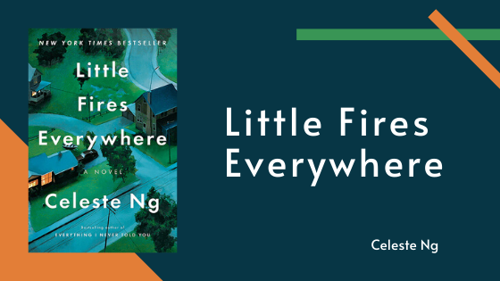

This month Jane heads into the recent past with Celeste Ng's *[Little Fires Everywhere](https://www.goodreads.com/book/show/34273236-little-fires-everywhere)*. There will be spoilers in this post!

 **Content Warning: This book includes sex and questionable racial depictions.**

## Summary

Title: *Little Fires Everywhere*

Author: Celeste Ng

Published: September 2017, Penguin Press

Genre: Domestic Fiction, Drama

<blockquote class="utl-blockquote--jane">
In Shaker Heights, a placid, progressive suburb of Cleveland, everything is meticulously planned – from the layout of the winding roads, to the colours of the houses, to the successful lives its residents will go on to lead. And no one embodies this spirit more than Elena Richardson, whose guiding principle is playing by the rules.

Enter Mia Warren – an enigmatic artist and single mother – who arrives in this idyllic bubble with her teenage daughter Pearl, and rents a house from the Richardsons. Soon Mia and Pearl become more than just tenants: all four Richardson children are drawn to the alluring mother-daughter pair. But Mia carries with her a mysterious past, and a disregard for the rules that threatens to upend this carefully ordered community.

When the Richardsons' friends attempt to adopt a Chinese-American baby, a custody battle erupts that dramatically divides the town and puts Mia and Mrs. Richardson on opposing sides. Suspicious of Mia and her motives, Mrs. Richardson becomes determined to uncover the secrets in Mia's past. But her obsession will come at unexpected and devastating costs to her own family – and Mia's.
Little Fires Everywhere explores the weight of long-held secrets and the ferocious pull of motherhood-and the danger of believing that planning and following the rules can avert disaster, or heartbreak.
</blockquote>

via <a href="https://www.penguinrandomhouse.ca/books/555134/little-fires-everywhere-by-celeste-ng/9780735224292">Penguin</a>

<h2 class="utl-color--jane">Jane's Thoughts</h2>

I assumed I would love *Little Fires Everywhere*. Multiple people I trust recommended it to me and said how much I would love it. I went in fully expecting to be blown away, but when I finished, my first reaction was just….BLAH!

I think the main issue was that it was recommended to me, was on the NYT bestseller list for months and months, and [has recently been made into a Hulu TV show](https://www.hulu.com/series/little-fires-everywhere-bce24897-1a74-48a3-95e8-6cdd530dde4c), so I assumed I would be captivated by it. I also loved the beginning of the book and assumed the book would challenge some of the problematic thoughts and actions of the characters.

One of the main plot points is the juxtaposition between Elena and Mia (how they relate to the world, their concept of right and wrong, their parenting philosophies, their priorities, etc). As the book was opening, I knew these two were destined to clash at some point! And they kind of did. But my expectations from the beginning were never fully realized.

The story itself was engaging and I read the book from start to finish in about a day and a half. I just had to figure out how the characters got back to the opening scene of the Richardson family home burning. The plot hits so many important topics: class distinctions, the struggles of the working class, the role race and culture play in our lives, the complexity of men’s issues vs women’s issues, specifically as it relates to reproduction. And I wanted all of this explored with a razor sharp examination of how the characters feel about these issues. Why they’re important. Why I as the reader should care! Instead, I just got a long story with no examination of the implications it was raising.

The biggest question mark I had at the end pertained to the younger of the Richardson boys, Moody. He takes a drastic turn during the course of the book from a quiet, contemplative, kind boy to a narcissistic one claiming to know what is right for his “best friend” Pearl. He turns angry toward her because she doesn’t have the romantic feelings for him that he has for her. On the one hand, this follows the same trajectory of many boys/ men who are situated firmly in the “friend zone” and who turn that into a hate for women. On the other, this isn’t stated or explored. In fact, the only time it’s even brought up by any of the characters, it’s his sister calling him an asshole. At the end, when Mia creates a piece of art for each Richardson, somehow, the depiction of his true character is Pearl’s journal pages shaped as birds, flying away. To me, this shows Moody’s feelings for Pearl were something he needed to grapple with. To let go. In reality, what Moody needed to do was look internally instead. He didn’t need anything from Pearl; he needed to not be an asshole himself.

*Little Fires Everywhere* was a quick read with an interesting story, but I’m not sure I liked anyone I was reading about. I have liked books where I didn’t enjoy any of the characters, but for some reason I just couldn’t get past it with this book. It irked me that there seemed to be clear cut characters we were meant to sympathize with, and others we were meant to loathe. I wish we had gotten a better look at the lasting effects the events that took place during the story had on the characters, or even saw positive growth. This book said a lot, but I’m not sure I liked what it was saying.  

I just wanted more. I wanted to be made to think about the characters. I wanted to be surprised by something, ANYTHING. I wanted a couple of the characters to be complex and have multiple motivations, to have a deeper belief about the world than “this was how I was born and raised so I’ve always felt this way!” There were so many themes to explore, and yet none of them were. To me, *Little Fires Everywhere* was an interesting story, but I stopped thinking about it almost as soon as I finished. Maybe I’ll give the TV show a try (I really have nothing better to do!)

---

*What did you think of "Little Fires Everywhere"? Join the discussion on [Facebook](https://www.facebook.com/groups/566114107531110/) or Instagram [@nerdgirlsbookclub](https://www.instagram.com/nerdgirlsbookclub/).*
