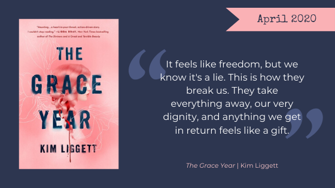

This month we read *[The Grace Year](https://www.goodreads.com/book/show/43263520-the-grace-year)* by Kim Liggett. In a surprisingly hopeful combination of *[The Handmaid’s Tale](https://www.goodreads.com/book/show/38447.The_Handmaid_s_Tale)* and *[The Lord of The Flies](https://www.goodreads.com/book/show/7624.Lord_of_the_Flies)*, Tierney James must survive the Garner County “Grace Year.” The Nerd Girls were both enthralled and disturbed, and we think you will be, too.

**Warning, Here Be Spoilers.**

<h2 class="utl-color--jane">Jane</h2>

### 👓👓👓👓👓 5 / 5

This is my favorite book we have read for book club so far. I really, really loved *The Grace Year*. I think the predominant reason for that is that about ⅓ of the way through the book, I kind of had an idea of where the book was going. I guessed about how Tierney would relate to the other Grace Year girls, what she would discover about herself and what she was supposed to learn from her year in the wilderness. AND THEN I WAS SO INCREDIBLY WRONG. Just absolutely wrong. And kept being wrong.

I finished the book and literally turned immediately back to page 1 to start it again. I had to see where I had gone so wrong. Why didn’t I see all the hints Ligget left for her reader? She laid it all out so perfectly that I created an entire INCORRECT narrative. And yet, the one she wrote was vastly more interesting than the one I thought was coming. I loved that there were complicated women written into the narrative. I loved that they weren’t all friends or even fighting together. I loved that that wasn’t even the point of the story.

DON’T READ ANY SPOILERS (hint: below are spoilers). But do read this book. Now.

<h2 class="utl-color--elizabeth">Beth</h2>

### 👓👓👓👓👓 4 / 5

I found *The Grace Year* to be a quick, compelling read. With quotes from both *A Handmaid’s Tale* and *Lord of the Flies* to start things off, author Kim Liggett makes no secret of her influences. I also felt echoes of other dystopian works such as *The Hunger Games.* Liggett does a good job of maintaining tension with her strong use of language, relatively short chapters, and chapter endings which are often full of strong emotion and drove me to keep turning pages. There were some great twists and surprises I appreciated more on a second reading.

I did encounter some clarity issues, first in regards to space—I couldn’t quite imagine the fenced area where the girls were staying—how big was the fenced area, really? Secondly, I was confused with regards to the passage of time, especially in the second half of the book. The ambiguous ending has me wondering what the sequel will look like, but I’ll be happy to check it out.

<h2 class="utl-color--catherine">Catherine</h2>

### 👓👓👓👓👓 4 / 5

Wow. Just, wow.

I [read an interview](https://www.brazosbookstore.com/articles/features/feminism-our-times-joy-interviews-kim-liggett-author-grace-year) with [Kim Liggett](https://www.goodreads.com/author/show/6693411.Kim_Liggett) where she described the desire to write a story from the perspective of "Now." And that's what *The Grace Year* is. It's not a story of how Garner County turned into what it was, and it's not a story of some grand revolution that takes everything down. It is the story of one girl living every day within the system, rebelling in small ways.

I found Tierney's mother to be the most compelling character in the story, "Your eyes are open and you see nothing." Tierney's mother was taking great risk every day, all the while gathering allies and helping outsiders. As I grow older, I see how my angry nineteen-year-old self wanted to burn the system down and start from scratch, and how irresponsible and naive that perspective was. Living within a system is not an endorsement of it. You don't start a revolution by putting yourself in danger.

One of the women at our book club meetup mentioned that she had originally though *The Grace Year* was a "coming of age" story. After finishing it, I think this is true. Sure, it's a different world from ours, but the internal conflict of growing from girl to woman in a troubled society is one we know very well. 

I've got minor complaints about clarity of writing, especially with the passing of time, but those are minor. This one is a 4/5 for me.

**Trope Warning**: A fairly straightforward [Florence Nightingale](https://tvtropes.org/pmwiki/pmwiki.php/Main/FlorenceNightingaleEffect) dressed up to be Stockholm Syndrome.

<h2 class="utl-color--lydia">Lydia</h2>

### 👓👓👓👓👓 4 / 5

I read *The Grace Year* in a single sitting; it was just that enthralling. But I can’t really explain why! There were issues with pacing—sometimes I thought days had passed in story only to find out it had been months—and I had a hard time getting a sense of the setting, which was actually really important for the plot. I didn’t love the romantic relationship. But despite that, I was really engaged in the story.

I did enjoy the growth of some of the characters, and the relationships we saw between some of the girls and between Tierney and her mother (and later her sisters). I wish we’d seen more of that than of the romance. I also enjoyed that there was no overthrowing of society; rather, the changes were subtle but no less important. Small changes over time add up, and that’s something that doesn’t always happen in dystopian YA fiction. I’d really like to see a sequel showing how those small changes have affected things down the line.

---

*What were your thoughts about "The Grace Year?" Join the discussion on [Facebook](https://www.facebook.com/nerdgirlsbookclub) or Instagram [@nerdgirlsbookclub](https://www.instagram.com/nerdgirlsbookclub/).*
