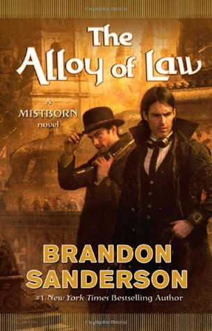

Which authors are you stalking—I’m sorry, loyally following on social media? Whose release dates are marked on your calendar? This month we’re talking about our “auto-buy” authors, those writers we know are (almost) guaranteed to give us what we need--whether it be an epic escape, a laugh, or a challenge.

And as a note, with everything going on, we'll be skipping our long post next week, and probably tuning down the number of posts through the summer. Don't worry, nerd folk, we'll still have a book club read for you every month.

Images in this article via <a href="https://www.goodreads.com/">Goodreads</a>

<h2 class="utl-color--jane">Jane</h2>

### [Liane Moriarty](https://www.goodreads.com/author/show/322069.Liane_Moriarty)

I love chick lit. I honestly always have, and as a junky for mysteries (mostly murder, but really any mystery will do!) Liane Moriarty has emerged as an expert story crafter. She has a sharp wit and her characters embody a wide range of voices that her books usually bounce between. Moriarty also has a way of rolling out information to the reader so you can ALMOST piece it together, but the twist at the end is always worth making it to the end.

While some of her books feel a bit repetitive, their entertainment value is worth it. There’s also something special about hearing how characters view one another and how they view themselves. My favorites of hers are *What Alice Forgot*, *Big Little Lies*, and *The Hypnotist’s Love Story*, but I will forever buy whatever she writes. (Especially now that it's summer and I need a good book to read on my back porch in the sunshine.)

<h2 class="utl-color--elizabeth">Beth<h2>

### [S.J. Kincaid](https://www.goodreads.com/author/show/4792223.S_J_Kincaid)

I stumbled upon S. J. Kincaid’s debut novel, *Insignia*, soon after it came out in 2012. It was an instant favorite. I usually pitch the book as “a cross between *Ender’s Game* and *Harry Potter*—but totally its own thing.” Back at a time when certain YA dystopian series were selling a gazillion copies, I had to wonder why a master like Kincaid wasn’t getting more love. She was, and remains, a brilliant writer. I followed the *Insignia* trilogy eagerly to the end. And you want to know what? The third book in the series, *Catalyst*, well…it really disappointed me.
Kincaid remains an auto-buy author for me, because I know the heights she can reach. Her second series, *The Diabolic*, again demonstrates her absolute genius at plotting and character. That book has so much great worldbuilding, character moments, and honestly shocking surprises. When I first read it, it felt like a complete story, and I almost didn’t want there to be a sequel. (Luckily the sequel is amazing too. But get ready for it to wreck you.)
I will be preordering the third *Diabolic* book, due out in August. And I plan to buy every other book Kincaid puts out.

<h2 class="utl-color--catherine">Catherine</h2>

### [Brandon Sanderson](https://www.goodreads.com/author/show/38550.Brandon_Sanderson)

Brandon Sanderson writes a mile a minute, and he's great at it. While his original claim to fame was the completion of Robert Jordan's "Wheel of Time" series, Sanderson is a fantastic author in his own right. And though I've never read "Wheel of Time," I am a serious *Sanderfan*.

When I pick up a Sanderson novel, I can expect an intricate magic system, a lush world, and characters with loads of issues. Plus, the largest collection of his works all tie together via something called "The Cosmere," a Marvel-level multiverse with a few "world-hopping" characters. "The Way of Kings" is still my favorite book of all time, and the Wax and Wayne books, which start with "Alloy of Law" are laugh-out-loud funny.

Sanderson's non-Cosmere installments are typically focused on the YA market and include the "Reckoners" series about superheroes-gone-wrong, and the newer "Skyward" books follow a remnant of humanity struggling to survive against an alien force.

Whatever the genre, I know what I'm getting when I buy a book with "Brandon Sanderson" on the cover: hundreds of pages of epic entertainment.

<h2 class="utl-color--lydia">Lydia</h2>

### [Patricia Briggs](https://www.goodreads.com/author/show/40563.Patricia_Briggs)

Way back when I was just a young thing, traveling the world (or at least the southwest of the US) with people I’d met on the internet, my friends and I got stuck waiting hours for a Greyhound bus. It was past 10:00 pm and the only thing open was a Barnes and Noble next to the station. So we took turns watching each other’s luggage and going to buy books to entertain ourselves. One of my friends handed me a collection of short stories featuring Patricia Briggs, and, well, that was it for me.

I’d never been an urban fantasy fan, and I’m only slightly more of one today. But I will 100% buy Patricia Briggs’s books. I like her fantasy books, but I LOVE her Mercy Thompson urban fantasy books. Partly it’s because Mercy is just a super cool character (she’s a VW mechanic whose superpower is shapeshifting into a coyote), but mostly I love the rich world Briggs created. She also does an excellent job of creating characters who stay true to their inner selves while also learning and growing. And she avoids the dreaded love triangle, for the most part (well, after the first book). When Briggs puts out a new book I not only know that I’ll enjoy the story, but that I’m going to be happy to reread them.

---

*Join the discussion on [Facebook](https://www.facebook.com/groups/566114107531110/) or Instagram [@nerdgirlsbookclub](https://www.instagram.com/nerdgirlsbookclub/) and tell us whose books you pick up time and time again.*
