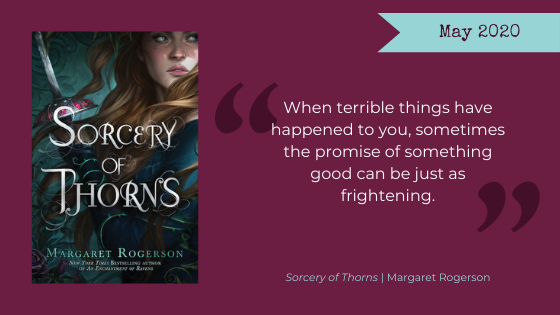

This month we read *[Sorcery of Thorns](https://www.goodreads.com/book/show/42201395-sorcery-of-thorns)* by Margaret Rogerson. This fantasy tells the story of Elisabeth, an orphan raised in a library where the books are alive--and sometimes quite dangerous--and Nathaniel, a sorcerer who has made a pact with a demon to secure his power. Although no one thought there was anything groundbreaking here, in general we liked this book pretty well.

**Warning, Here Be Spoilers.**

<h2 class="utl-color--jane">Jane</h2>

### 👓 👓 👓 👓 3.5 / 5

I liked this book.

The world created by Rogerson was interesting and well-developed. I really felt like there were people living in her world, that you could be dropped into one of the towns and know what those around you were doing, what their world was like. I also appreciated that the build up of the novel had many small problems to be resolved rather than everything leading to one giant climax. Of course, there was an epic battle at the end, but our trusty heroes had to face challenges leading up to the final battle.

I also loved how equal our two main characters, Nathanial and Elisabeth were. While they were a bit predictable and fell into some of the tropes of YA protagonists falling in love, I appreciated their story and believed in their romance. In addition, I loved Silas, someone who never lied about who he was, but was also consistent throughout. Even to the end, I appreciated some of the ambiguity we were left with.

<h2 class="utl-color--elizabeth">Beth</h2>

### 👓 👓 👓 👓 3.5 / 5

It took me a while to get into *Sorcery of Thorns*. The beginning felt kind of disjointed and I didn’t get a good read on Elisabeth’s character. Also—perhaps owing to what I read immediately before—I found the prose bogged down by lavish description. As the book went along, I adjusted to the language and grew more invested in the story, especially the last half/third. A lot of it felt episodic, but things did get tied together toward the climax. There was a lot of interesting worldbuilding—I liked the magic system and the books that were alive. (Since the wizards have to bargain with demons for their power, I found it difficult to avoid making mental comparisons to *[Howl’s Moving Castle](https://www.goodreads.com/book/show/6294.Howl_s_Moving_Castle)*, which is to *Sorcery*’s detriment—Nathaniel and Silas, while I did like them, are no Howl and Calcifer.)

As a writer myself I find protagonists really hard to write. And “Unlikeable” female characters definitely get a bad rap. But...I just didn’t like Elisabeth. Or, rather, I found her characterization to be muddled. The characters around her were much more interesting.

There was enough good here I might be checking out Rogerson's other work in the future.

<h2 class="utl-color--catherine">Catherine</h2>

### 👓 👓 👓 3 / 5

Last month we talked about "auto-buy" authors, but I've got an "auto-buy" illustrator, as any cover done by [Charlie Bowater](http://www.charliebowater.net/) pretty much guarantees a pre-order from me. That said, this book has such a beautiful, rich world, but ultimately I struggle to say I "loved" it.

Let's be real: there is nothing as tempting as the idea of growing up in a library full of magical books that talk to you. Better yet,  that "librarian with a sword" is a valid career path. I also enjoyed Nathaniel as a character, with all his apparent flaws and sad bachelorhood. I also thought Silas and the origin of sorcery were rich details in an otherwise cyclical, predictable adventure.

I think my biggest gripe is how this book is labeled as YA, but the plot devices are straight out of middle-grade. The main character is virtuous, but has to break the very carefully defined rules of the adults in order to have any amount of success. I also thought she came off as juvenile, whereas Nathanial was a much more typical YA romantic interest. This maturity imbalance made the romance disjointed.

By the end of the book, however, I was enthralled with the story, and surprisingly looking forward to the next one.

**Trope Warning**:  Elizabeth is a classic case of a [Horrible Judge of Character](https://tvtropes.org/pmwiki/pmwiki.php/Main/HorribleJudgeOfCharacter). Growing up in a library sure makes you naive!

<h2 class="utl-color--lydia">Lydia</h2>

### 👓 👓 👓 👓 3.5 / 5

I enjoyed this book. It wasn’t anything groundbreaking, and I sometimes wanted to shake some of the characters, but overall, I’m glad I read it. Sometimes all I ask from a book is that it be enjoyable and not require much from me; I call these kinds of books “mental sorbets” as they cleanse my mental palate to help me be able to handle heavier reading in the future. *Sorcery of Thorns* was a great mental sorbet. The story was predictable, and the romance was kind of forced, but there wasn’t anything exactly *wrong* with either. I did love Silas, and I would happily pick up any sequel that featured him.

Overall, the book was inoffensive and pleasant and I wouldn’t hesitate to read anything else by this author.

---

*What were your thoughts about "Sorcery of Thorns?" Join the discussion on [Facebook](https://www.facebook.com/nerdgirlsbookclub) or Instagram [@nerdgirlsbookclub](https://www.instagram.com/nerdgirlsbookclub/).*
