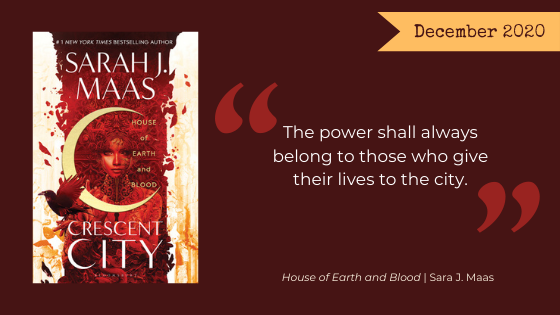

Wow. What a year. We took a break back in May in support of the global discussion on racism. It never felt right to come back, with the ongoing discussion, personal experience and hardship due to COVID-19 in America, and an increasing political subtext to everything we’ve done in the months since. But this year hasn’t been all bad - we’ve had TWO beautiful book club babies, a brand new kitten, and we’re closer friends than ever.

So it is with the final month of 2020 that we’re getting back on track with regular posts. You may see less from us - a long post every month isn’t possible. But we’ll still choose a book club read and offer you suggestions via some fun list posts every month.

This month we’re going full escapist fantasy with our old standard, Sara J. Maas, and the first entry in her newest series, _[House of Earth and Blood (Crescent City #1)](https://www.goodreads.com/book/show/44778083-house-of-earth-and-blood)_. We’ll also share some of our favorite books written by Black Authors.

Get back into book club with our December book club pick, *House of Earth and Blood* by Sara J. Maas and join our discussion on [Facebook](https://www.facebook.com/nerdgirlsbookclub) and follow us on Instagram [@nerdgirlsbookclub](https://www.instagram.com/nerdgirlsbookclub/)!

## December's Book Club Pick

From [Sara J. Maas](https://sarahjmaas.com/house-of-earth-and-blood/):

<blockquote>
Bryce Quinlan had the perfect life—working hard all day and partying all night—until a demon murdered her closest friends, leaving her bereft, wounded, and alone. When the accused is behind bars but the crimes start up again, Bryce finds herself at the heart of the investigation. She’ll do whatever it takes to avenge their deaths.

Hunt Athalar is a notorious Fallen angel, now enslaved to the Archangels he once attempted to overthrow. His brutal skills and incredible strength have been set to one purpose—to assassinate his boss’s enemies, no questions asked. But with a demon wreaking havoc in the city, he’s offered an irresistible deal: help Bryce find the murderer, and his freedom will be within reach.

As Bryce and Hunt dig deep into Crescent City’s underbelly, they discover a dark power that threatens everything and everyone they hold dear, and they find, in each other, a blazing passion—one that could set them both free, if they’d only let it.

With unforgettable characters, sizzling romance, and page-turning suspense, this richly inventive new fantasy series by #1 New York Times bestselling author Sarah J. Maas delves into the heartache of loss, the price of freedom—and the power of love.
</blockquote>

Stay safe out there, we’re nearly into the new year.

The Nerd Girls
